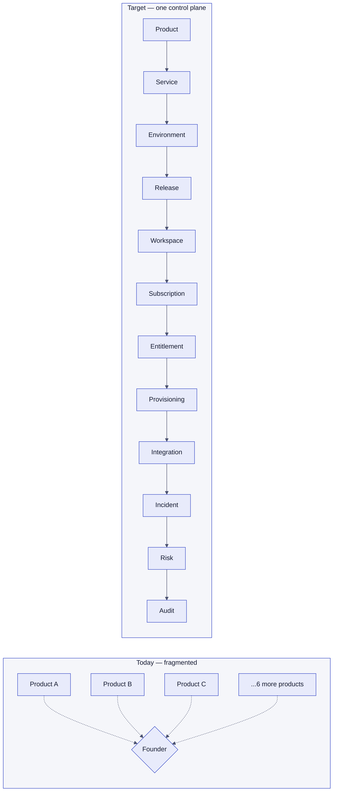
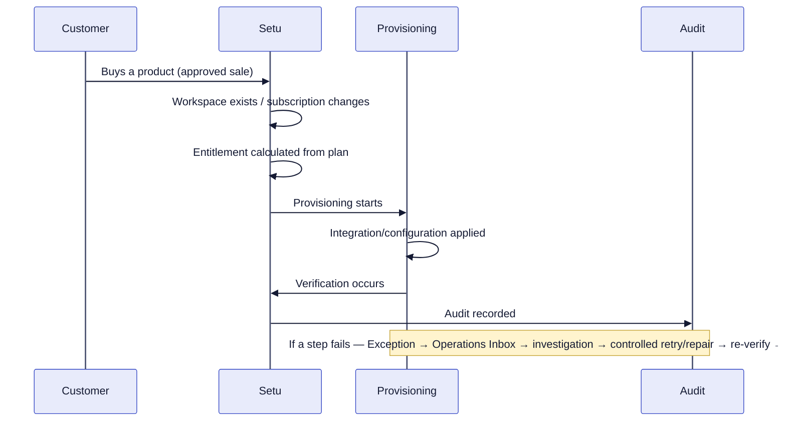
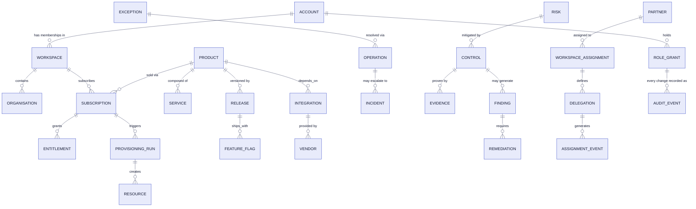
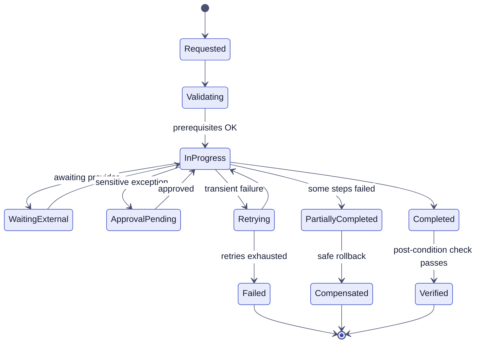
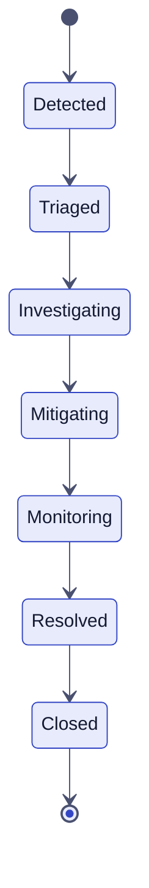
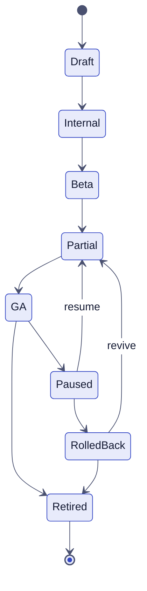
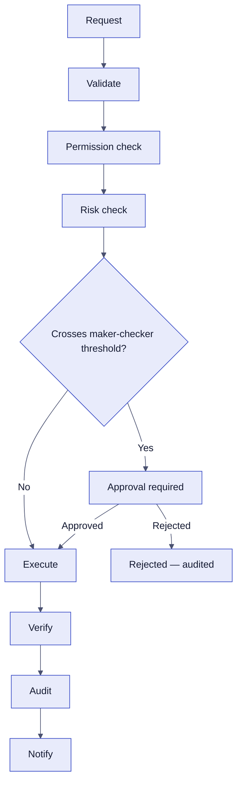
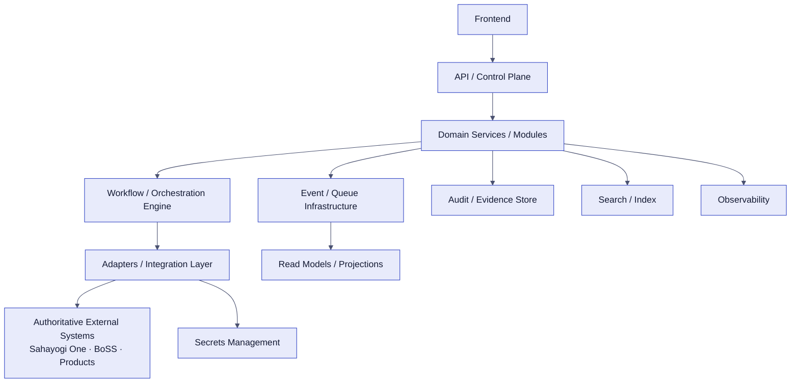

# SAHAYOGI SETU V2
## Internal Ecosystem Control Plane
### Founder / Technical Product Blueprint
*Product Vision, Operating Model, Features, RBAC, Architecture and End-to-End Delivery Plan*

---

## Document Control

| Field | Value |
|---|---|
| Document version | **1.5** |
| Date | **2026-10-04** |
| Status | Draft for founder/leadership review — navigation and Founder-authority sections now **RESOLVED**, binding |
| Prepared by | Technical Lead |
| Intended audience | Founder, CTO/Technical Leadership, Engineering Lead, Product Lead, Security Lead, Compliance Lead, Engineering Team |
| Source basis | `Sahayogi Setu V2 Detailed Architecture, Operations & Execution Blueprint` (21 Sep 2026); `Setu V2 Team Roles and Screen Design Guide` (22 Sep 2026); six persona-specific role documents (Platform Administrator, Customer Operations Agent, Security Administrator, Auditor/Reviewer, Partner Operations, Navigation Architecture Guide); `Setu_Master_Feature_Roadmap.md` (2026-10-03, includes the Founder-authority amendment); Founder/Compliance Officer/Engineering Lead dashboard data specs; competitive research set; this repository's current source code; **the v1.5 Master Blueprint Update directive (2026-10-04) — binding navigation and Founder-authority decisions** |
| Designation | Internal — Confidential |

**Version 1.5 — Navigation, Persona and Implementation Contract Amendment.** Key changes in this revision:

1. Setu logo is Home — the logo/icon at top-left is the Home navigation; clicking it routes to the signed-in persona's Home.
2. Home/Dashboard removed from the sidebar as a named item.
3. Control Room removed from the sidebar as a named item (it is still the **content** shown at Founder's Home — only its sidebar entry is removed).
4. Operations Inbox remains a separate, first-class sidebar destination — not folded into Home, not a Control Room tab.
5. One canonical sidebar defined for all 12 personas — see §8A.
6. Complete 12-persona × sidebar-item functional-state matrix defined — see §8B and `PERSONA_SIDEBAR_MATRIX.md`.
7. Detailed persona-specific Home data contracts defined — see §8C and `PERSONA_DATA_CONTRACT.md`.
8. Founder confirmed as Super Admin — full view and broad execute/approve/configure authority across every Setu domain, governance mechanics unchanged. D1 and the Founder-authority item in §49/§51 are now marked **RESOLVED**.
9. Founder receives the full ecosystem control-plane experience, not a dashboard-only product — see §8D.
10. Internal capabilities (People, Message Delivery, Technical Logs, Allocations, Feature Matrix) confirmed as consolidated into their parent domains, not standalone sidebar items.
11. Product ecosystem confirmed architecturally dynamic — no hardcoded product count anywhere in this document or the target architecture.
12. The three-way navigation conflict recorded in v1.0 (§49 D1) is resolved by this revision, not left open.
13. This blueprint is explicitly established as the master implementation contract — see the new §0 below.

**Claim classification used throughout this document:**

| Tag | Meaning |
|---|---|
| **SOURCE-DEFINED** | Stated explicitly in a blueprint/role document |
| **CURRENT-IMPLEMENTATION** | Verified in this repository's actual code today, cited by file path |
| **RESEARCH-DERIVED** | From the competitive research set, not in the blueprint itself |
| **ENGINEERING RECOMMENDATION** | This document's own technical-lead judgment, offered where the source is silent |
| **OPEN DECISION** | Unresolved in the source material, or in conflict between sources — not silently picked |

---

## 0. Purpose of This Blueprint

**ENGINEERING RECOMMENDATION, elevated to a binding statement by the v1.5 directive.** Sahayogi Setu V2 is an internal ecosystem control plane. This blueprint is the **master product and technical specification** used to build it — not a documentation or reporting artifact, and not a founder presentation deck.

It is the contract between **Founder, Product, Design, Engineering, Security, Compliance and QA** and the actual Setu application. It defines the target product, navigation, personas, data contracts, permissions, workflows, action model and implementation boundaries that every team works from.

**What this means in practice:**
- Every major product decision should be traceable to this blueprint.
- Every major screen should be derivable from this blueprint — not invented in Figma or in code without a corresponding entry here.
- Every privileged action has an explicitly defined permission, reason requirement, approval requirement, verification requirement and audit requirement, stated in this document, not assumed by whoever implements it.
- Every backend implementation must respect the data ownership and system-of-record boundaries defined in §5.

**The path from requirement to screen, and the rule that governs it:**


**DO NOT START FROM SCREENS.** A screen that cannot be traced back through this chain to a persona, a primary question, a data contract, a state machine, a permission and an audit requirement is not ready to build — it is a guess wearing a UI. This rule applies to every stream in §46.

This document is therefore, simultaneously: a **master product specification**, a **master UX/navigation contract** (§8A–§8D), a **master RBAC/authorization contract** (§30–§32), a **master technical blueprint** (§36–§43), and a **master implementation reference** (§45–§47). It supersedes any screen, navigation, or persona decision made informally outside it — if code or design diverges from this document, the divergence is a defect to resolve, in either direction, not a silent fork.

---

## Executive Summary

**SOURCE-DEFINED.** Sahayogi Setu V2 is the internal ecosystem control plane for the Sahayogi group of products. It governs, administers, observes, secures and orchestrates the ecosystem **without duplicating** business operations already owned by BoSS (Sahayogi's internal CRM/Finance/HR/Support) or by Sahayogi One (identity) or by any individual product. [Blueprint §0, §1]

**The problem today, stated plainly:** Sahayogi runs 9 products, each with its own operational state — who's subscribed, what's healthy, what changed, who has access, what's compliant. Right now, answering "is the ecosystem okay?" means opening nine different systems and manually correlating what you find. There is no single place that ties **Product → Service → Environment → Release → Workspace → Subscription → Entitlement → Provisioning → Integration → Incident → Risk → Audit** into one traceable journey. **[Blueprint §28.1, "Canonical correlation"]**

**What Setu changes:** one control plane that lets any authorised person — founder, platform engineer, support agent, security administrator, auditor — follow that same chain for any real event, in a few clicks, with permission enforced and every action recorded.

**Current build state (CURRENT-IMPLEMENTATION, verified against this repository, 2026-10-03):** Setu today is a **frontend-only Next.js application on a typed mock-data layer** — no backend yet. The data layer (`lib/mock-data/*.ts`) is shaped like the eventual API response, so swapping in real services later is a data-layer change, not a UI rewrite. Of the **12 personas** the blueprint defines [Blueprint §6], **3 have any routing** (`lib/personas.ts`: `founder`, `engineering-lead`, `compliance-officer`) and only **Founder is substantively built** — 12 live sections, several with real create/edit/action flows wired through `lib/store/decisions-store.ts` (452 lines, a reason-gated, audit-logged write layer). `compliance-officer` has nav config (`components/shell/Sidebar.tsx`) but zero pages. The other 9 personas have no routing at all.

**The decision that reshapes the delivery plan (ENGINEERING RECOMMENDATION, built on the latest dated source):** `Setu_Master_Feature_Roadmap.md`'s 2026-10-03 amendment states Founder's own UI absorbs full write/action capability across every domain, rather than each of the other 11 personas being built as a separate route. This document treats that amendment as the **current governing decision** — the newest dated source in the whole corpus — and threads it through the RBAC matrix, the screen map and the delivery plan below. It does **not** override the underlying permission model: every absorbed action still requires Permission → Reason → Execute → Verify → Audit [Blueprint §1.1], exactly as if a separate persona had performed it. See §30 for how Founder's broad authority and the Super Admin security concept stay distinct.



---

## 1. Why Setu Exists

**SOURCE-DEFINED.** Every material capability in Setu exists to support one execution loop, applied to any real operational event: **Detect → Investigate → Decide → Authorise → Execute → Verify → Record → Learn.** [Blueprint §1] A capability that cannot be checked against this loop is not yet a real requirement.

Business-language framing (ENGINEERING RECOMMENDATION, following this document's own house style — business language first, technical implementation second, throughout):

> A customer's product breaks. Today: someone notices, pings a Slack channel, several people open several different admin panels, someone eventually finds the cause, fixes it by hand, and nobody writes down exactly what happened or why. With Setu: the break is detected and correlated automatically, lands in one inbox with the right owner already assigned, the owner investigates from one screen that already has the workspace/subscription/release/integration context attached, executes a governed fix (not a raw database edit), the system verifies the fix worked, and every step is on the record — searchable by anyone authorised to look, including an independent auditor who wasn't in the room.

**The central example, worked end to end (SOURCE-DEFINED, Blueprint §1, UC-01/UC-02):**



This is why Setu is more than a dashboard: a dashboard shows facts. Setu is designed so every fact traces to an owner, an action, and evidence — the **Decision Test** that every blueprint metric must pass [Blueprint §21, §33]: *"Does every dashboard number lead to evidence, an owner, or an action?"*

---

## 2. Setu Product Vision

**SOURCE-DEFINED.** Setu's responsibility, stated directly from the blueprint's core proposition [Blueprint, cover]:

> Setu governs, administers, observes, secures and orchestrates Sahayogi without duplicating business operations already owned by BoSS or another Sahayogi product.

Concretely, Setu:
- governs workspace, subscription, entitlement and provisioning lifecycle
- observes platform health, reliability and incidents
- secures privileged access, sessions and compliance posture
- orchestrates controlled operational workflows (provisioning, repair, drift reconciliation)
- provides cross-product operational intelligence (cost, usage, adoption)
- manages compliance, risk and audit evidence

**Setu is explicitly NOT** [Blueprint §0, §2; reinforced independently in `Setu_Feature_Decision_Pitch.md` and `Setu_V2_Blueprint_Review_Redline.md` C2]:
- another ERP, CRM, accounting system, or HR system
- a replacement for product business applications
- a replacement for Sahayogi One identity
- a replacement for CI/CD
- an infrastructure monitoring product (RESEARCH-DERIVED, `Setu_Feature_Decision_Pitch.md`: explicitly rejects Site24x7-style 300+ monitor types as out of scope — "this belongs to whichever Sahayogi product actually runs the infrastructure")

---

## 3. Current Problem / Current State

**ENGINEERING RECOMMENDATION**, synthesizing the blueprint's own framing [Blueprint §0] with this repository's actual state:

| Symptom today | Root cause |
|---|---|
| Ecosystem information is distributed across 9 products | No single authoritative correlation layer — each product owns its own operational view only |
| Provisioning/lifecycle operations need manual orchestration | No workflow engine; state changes happen ad hoc per product |
| Health/incidents aren't correlated across products | No shared incident/observability model; each product's reliability signal is siloed |
| Product ownership and dependencies aren't governed as one model | `lib/mock-data/products.ts` **(CURRENT-IMPLEMENTATION)** today carries only `{id, name, brand, health, dependencyCount: number, adoptionPct, usageTrend30d}` — no owner, no typed dependency graph, no lifecycle stage |
| Privileged actions have no central governance | **CURRENT-IMPLEMENTATION:** zero RBAC code exists anywhere in this repository — confirmed by inspecting `lib/`, `components/`, `app/` |
| Compliance evidence isn't traceable | Compliance Officer persona has nav config but zero pages **(CURRENT-IMPLEMENTATION, `components/shell/Sidebar.tsx`)** |
| Executives need one operational truth without opening many products | This is Founder's literal defining question **[Blueprint §6]** — the one persona that is substantively built today |

**Current build state detail (CURRENT-IMPLEMENTATION):**

| Area | State |
|---|---|
| Frontend | Next.js (App Router) + Tailwind, hand-built components, no component library |
| Data layer | `lib/mock-data/*.ts` — typed, shaped like the eventual API response |
| Write/action layer | `lib/store/decisions-store.ts` (452 lines) — session-only mutable state via `useSyncExternalStore`, every write reason-gated through `components/shared/ConfirmActionDialog.tsx` and audit-logged |
| Backend | None |
| Personas routed | 3 of 12 (`founder`, `engineering-lead`, `compliance-officer` — `lib/personas.ts`) |
| Personas substantively built | 1 of 12 (Founder — 12 live sections under `app/founder/*`) |
| RBAC | Zero code |
| Audit | A real append-only-style mock log exists (`lib/mock-data/audit-explorer.ts`, live-wired via the store), validated against every reference product researched as structurally correct — the one area already close to target shape |

---

## 4. Target State

**SOURCE-DEFINED**, the blueprint's own target-state framing [Blueprint §28, §32], **bounded by the C1 scope-risk flag** in `Setu_V2_Blueprint_Review_Redline.md`: §28's sixteen-component technical architecture is a **multi-phase target**, not a "build now" instruction. Nothing in §28 should be read as needed for the current frontend-only build.

Target state, in the founder's own terms: one control plane where —
- every executive metric drills into evidence, an owner, and a next action [Blueprint §21 Decision Test]
- every privileged action is permissioned, reasoned, executed, verified and audited [Blueprint §1.1]
- a new product can be onboarded without redesigning Setu [Blueprint §33 Scale Test — see §36 of this document]
- an independent reviewer can reconstruct any significant action without relying on memory, chat, or email [Blueprint §27]

---

## 5. System Boundaries & Ownership

**SOURCE-DEFINED.** This is the single most load-bearing principle in the whole blueprint: **"One authoritative source per domain; Setu may aggregate without becoming the owner."** [Blueprint §1.1]

| Domain | System of Record | What Setu Does | What Setu Must NOT Own |
|---|---|---|---|
| Identity, accounts, memberships, product access | **Sahayogi One** | Administers only through authoritative APIs | Never re-implements identity/login |
| Leads / opportunities | **BoSS Sales CRM** | Context + deep link only | No duplicate CRM record |
| Customer cases | **BoSS Customer Service** | Context + diagnostics correlation | No duplicate ticketing system |
| Accounting / invoices / receivables | **BoSS Finance & Accounting** | Consumes approved commercial state for platform enforcement only | No ledger, no ₹ figures displayed anywhere in Setu |
| HR | **BoSS HR** | Consumes approved identity/offboarding events | No HR records |
| WhatsApp business data | **Chat with Sahayogi** (the product) | Health, integration and usage context | No message content ownership |
| Product business data | **Respective product** | Read-only, when operationally justified | Never the authoritative copy |
| Subscription / entitlement state | **Setu** | Owns and governs | — |
| Provisioning state | **Setu** | Owns and governs | — |
| Platform incidents | **Setu** | Owns and governs | — |

**Metadata required for every Setu field/action [Blueprint §2.1]** — this is the discipline that keeps the boundary enforced in practice, not just on paper:

| Attribute | Decision required |
|---|---|
| Source of truth | Which service owns this fact? |
| Read path | API, event projection, cache/query, or deep link? |
| Write authority | Can Setu change it, and through which API/workflow? |
| Audit | What evidence is mandatory? |
| Approval | None, conditional, maker-checker, or security approval? |
| Classification | Internal / confidential / restricted |
| Retention | How long does Setu retain the projection/evidence? |
| Failure owner | Who receives the exception if this fails? |

**Tenant Zero — Setu's own internal workspace [Blueprint §3]:** Sahayogi consumes its own ecosystem through one protected internal workspace. It cannot be accidentally deleted or disabled; founders and protected governance assignments carry special safeguards; it is the first target for internal/alpha feature rollouts. Setu privilege is deliberately **separate** from membership in this workspace — being a member doesn't grant Setu access, and vice versa.

| Persona (normal workspace) | Normal Sahayogi workspace system | Setu access |
|---|---|---|
| Sales | BoSS CRM | No Setu access by default |
| Finance | BoSS Finance | No Setu access by default |
| Support | BoSS Customer Service | Diagnostic access if authorised |
| Platform Engineer | Relevant products | Operations/provisioning/health |
| Compliance | Evidence-related access | Controls/risks/audit |
| Founder | Broad authorised visibility | Executive control + explicit admin rights |

---

## 6. Setu Capability Map

**SOURCE-DEFINED**, 17 capability domains [Blueprint §4]:

| Domain | Scope |
|---|---|
| Ecosystem Registry | Products, modules, services, dependencies, plans, features, environments, endpoints, meters, health signals |
| Workspace Administration | Workspace 360, organisations, ownership, lifecycle, protected-workspace rules |
| Subscriptions & Entitlements | Trials, plans, features, quantities, consumption limits, add-ons, overrides |
| Provisioning Orchestration | Create/configure/upgrade/downgrade/suspend/reactivate/deprovision/retry/verify |
| Platform Operations | Jobs, queues, schedulers, events, webhooks, controlled admin operations |
| Observability & Reliability | Metrics, logs, traces, health, dependencies, incidents, SLO/SLA signals |
| Integration Control Centre | Meta, Tally, BUSY, payments, email/SMS, tax APIs, AI/model providers |
| Usage & Metering | Meters, usage events, aggregation, quotas, alerts, enforcement |
| Cost Intelligence | Workspace/product/API/AI/storage/message cost attribution, unit economics |
| Security & Privileged Access | RBAC/ABAC, MFA, sessions, temporary elevation, access reviews |
| Audit & Compliance | Frameworks, controls, evidence, tests, findings, remediation, attestations |
| Risk & Vendor Governance | Risks, treatments, vendors, criticality, reviews, third-party incidents |
| Configuration & Feature Management | Flags, configuration, staged rollout, kill switches, beta/internal targeting |
| Release & Environment Governance | Versions, deployments, migrations, rollout/rollback, environments |
| Automation / Rules / Workflow | Events, conditions, rules, workflows, approvals, timers, escalations |
| Exception & Operations Inbox | Failures, drift, approvals, incidents, compliance/security actions |
| Data Governance & Privacy Ops | Classification, retention, privacy requests, deletion eligibility, evidence |
| Platform Analytics | Adoption, provisioning success, reliability, multi-product usage, operational KPIs |
| Administrative Repair & Reconciliation | Safe replay/re-sync/recalculate/repair, expected-vs-actual drift |

**Critical design rule, explicit in the master prompt and consistent with the blueprint's own IA caution [Blueprint §22]: CAPABILITY ≠ SIDEBAR ITEM.** Not every capability above becomes a top-level nav item. Many are tabs, contextual panels, drawers, 360-page sections, or command-palette actions. See §27 (Screen/Feature Map) and §9 (Navigation) for exactly how each capability surfaces.

---

## 7. Core Domain Model

**SOURCE-DEFINED**, 22 Core Domain Objects [Blueprint §5]:

| Object | Purpose / relationship |
|---|---|
| Account | Identity anchor linked to memberships and access |
| Workspace | Primary customer/internal operating boundary |
| Organisation | Business entity within a workspace where applicable |
| Product | Commercial/application product |
| Service / Component | Technical dependency supporting a product |
| Plan | Commercial packaging definition |
| Subscription | Workspace × product lifecycle record |
| Entitlement | Effective feature/limit from plan, add-on or controlled override |
| Resource | Provisioned product/infrastructure object |
| Integration | Connection to internal/external provider |
| Meter / Usage Record | Consumable definition and measured consumption |
| Environment | Development, test, staging, production (future: sandbox) |
| Release / Deployment | Version movement and operational state |
| Feature Flag | Controlled exposure rule |
| Event | Canonical occurrence emitted by a system |
| Workflow Run | Execution instance of a multi-step process |
| Operation | Privileged/admin action requested by human or automation |
| Exception | Actionable failure or inconsistency |
| Incident | Platform reliability/security event |
| Control / Evidence | Compliance requirement implementation and proof |
| Risk / Vendor | Governance objects for risk and third parties |
| Audit Event | Immutable record of significant action/change |

**OPEN DECISION — two objects are missing from this list, found independently by `Setu_V2_Blueprint_Review_Redline.md` (A1, A2) and corroborated by the Partner Operations role document you provided:**

1. **`Partner` is not a Core Domain Object**, yet §6's persona table gives Partner Operations a full row and §7's Mandatory 360 Views list omits Partner 360 entirely. The Partner Operations brief you provided confirms this independently: *"the source material for this role is thinner than usual... the full Partner 360 field list [is] not yet decided."* **Recommendation (ENGINEERING RECOMMENDATION, following the Redline's proposed shape):** model three related entities, not one flat record — `Partner`, `WorkspaceAssignment`, `AssignmentEvent` — with mandatory expiry/next-review-date on every assignment. **Do not design Partner screens until this object model is confirmed.**
2. **`Approval Request` is a queue filter, not an object.** Approvals appear in the Operations Inbox, in UC-11, and in the maker-checker concept [§16.3], but nothing defines a standalone, paginatable `Approval Request` object. **Recommendation:** add it, with a state machine `Requested / Pending / Approved / Rejected / Expired / Executed`, and resolve whether one `Operation` can have multiple sequential approvals (segregation-of-duties chains) — unresolved in every source document reviewed.

**RESEARCH-DERIVED addition, `Setu_V2_Blueprint_Review_Redline.md` B1** — also missing: a **`Notification Target`** object (named, reusable recipient group/channel set — user group, on-call rotation, escalation chain) referenced by ID from workflows, alerts and approvals rather than redefined per feature. This is the pattern that lets a mature ops platform (the redline's Site24x7 reference) support hundreds of alert types with one consistent "who gets notified" behavior instead of each feature reinventing it.



**Which relationships are owned vs. computed vs. projected (ENGINEERING RECOMMENDATION):**

| Relationship type | Examples | Rule |
|---|---|---|
| Owned by Setu | Subscription, Entitlement, Provisioning, Incident, Audit Event | Setu is system of record; writes happen here |
| Sourced externally | Account/identity (Sahayogi One), CRM/case context (BoSS) | Setu reads via API/event, never writes back the authoritative copy |
| Computed | Product `dependencyOf` (incoming dependency edges), vendor `criticality` (from `residualRisk`), product `health` (from scorecard) | Never separately authored — derived at read time from facts, so it can't drift from the numbers it's based on (RESEARCH-DERIVED pattern, `Setu_Ecosystem_Registry_Feature_Research.md`, converged across Backstage/Cortex/OpsLevel/ServiceNow) |
| Event-driven | Incident creation from monitoring correlation, drift detection | Emitted by the system in response to a canonical event, not directly authored by a human |

---

## 8. Product & Service Registry

**SOURCE-DEFINED.** The Ecosystem Registry domain [Blueprint §4] is the foundation everything else reads from: you cannot provision or entitle something that isn't registered.

**CURRENT-IMPLEMENTATION, verified gap:** `lib/mock-data/products.ts` today models each of the 9 real products (BoSS, Chat with Sahayogi, Sahayogi One, Sahayogi Cloud, Tax Sahayogi, Office Sahayogi, Investor Sahayogi, My Sahayogi, Studio Sahayogi) as `{id, name, brand, health(enum), dependencyCount(number), adoptionPct, usageTrend30d, description}`. No owner, no environment list, no real dependency graph (just a count), no lifecycle stage.

**RESEARCH-DERIVED target model**, converged independently across Backstage, Cortex, OpsLevel and ServiceNow CMDB [`Setu_Ecosystem_Registry_Feature_Research.md`] — four patterns to adopt with confidence:

1. **Replace `dependencyCount: number` with a real typed, directional dependency graph.** Each product declares its own *outgoing* dependencies (`dependsOn`); the *incoming* side (`dependencyOf` — "who depends on me") is **computed, never separately authored**. This turns "BoSS depends on 6 things" (meaningless) into "if Sahayogi Cloud goes down, BoSS and Tax Sahayogi are both affected" (answerable) — for free.
2. **Add `owner`, `lifecycle`, `tier`, `tags` as first-class fields**, not folded into `description`.
3. **Replace the hand-set `health` enum with a facts → checks → scorecard pipeline** — raw data points pulled per product, checks evaluated against a threshold, a scorecard a human actually reads. "Why is Tax Sahayogi marked warning" becomes answerable ("2 of 5 production-readiness checks failing") instead of an opaque enum someone typed in.
4. **Tier-mismatch should be a standing, always-visible signal on the graph itself** — if a Tier-1 product depends on a lower-tier one, an alert icon appears on the dependency edge, the dependency list, and the product table row simultaneously. Cheap once points 1 and 2 exist — it's a derived view, not new data.

**Explicitly skip (RESEARCH-DERIVED, named per source — don't reach for these):**

| Source | Feature | Why skip |
|---|---|---|
| Backstage | Software Templates / Scaffolder | Setu governs 9 *existing* products; it never originates new codebases |
| Cortex | Full standalone DORA analytics module | Disproportionate at 9-product scale; keep deployment metrics as scorecard *inputs*, not a separate surface |
| OpsLevel | 10-way check-type taxonomy | Built for orgs scanning thousands of git repos; a simple pass/fail checklist covers Setu's need |
| ServiceNow | Full 5-tier CSDM + auto-discovery Service Mapping | Built for thousands of live-discovered CIs; 10x more machinery than 9 in-house products need |

**Proposed `Product` object model (ENGINEERING RECOMMENDATION, supersedes `lib/mock-data/types.ts`'s current shape):**

```ts
type Product = {
  id: string;
  name: string;
  brand: string;
  owner: { team: string; contact?: string };          // currently missing
  lifecycle: "experimental" | "beta" | "production" | "deprecated"; // currently missing
  tier: "tier-1" | "tier-2" | "tier-3";                 // currently missing — drives governance rules
  tags: string[];                                       // currently missing
  dependsOn: { productId: string; type: "depends_on" | "communicates_with" }[];
  // dependencyOf: computed at read-time, never authored
  scorecard: {
    checks: { id: string; label: string; passed: boolean; fixMessage?: string }[];
    mode: "gated-levels" | "points";
  };
  health: "healthy" | "warning" | "critical";           // DERIVED from scorecard, not hand-set
  adoptionPct: number;
  usageTrend30d: number[];
};
```

**Product List vs. Product Card vs. Product 360 vs. Registry — explicit separation:**

| Surface | Purpose |
|---|---|
| Product List | Discovery and search across all products |
| Product Card | Compact operational quick view (inline, e.g. in a table row) |
| Product 360 | Deep investigation and operational context (see §9) |
| Registry / Administration | Governed configuration/authoring — separated from day-to-day operating screens because a change here can affect every workspace on a plan at once [Platform Administrator role document, §3.11] |

**Recommended product lifecycle (ENGINEERING RECOMMENDATION — blueprint doesn't define exact states, only "lifecycle" as a concept):** `Planned → Configured → Validated → Active → Degraded → Restricted → Retired`. Mark as proposed, not policy-confirmed — align with whatever state machine review happens per §29 of the source blueprint before implementation.

---

## 8A. Navigation Architecture — RESOLVED, v1.5

**RESOLVED by the v1.5 directive.** This supersedes §49 D1 in full — the three-way navigation conflict recorded in v1.0 is closed. Full detail also stands alone in `NAVIGATION_ARCHITECTURE.md`.

**Home = the Setu logo.** The logo/icon at top-left of the shell is the Home navigation control. It is not a sidebar item. Clicking it routes the signed-in user to their **persona-specific Home**:

| Persona | Home destination |
|---|---|
| Founder / Executive (Super Admin) | Founder Control Room |
| Platform Administrator | Platform Operations Home |
| Customer Operations Agent | Customer Operations Home |
| Technical Support Agent | Support / Diagnostics Home |
| DevOps / SRE | Reliability Home |
| Engineering Lead | Engineering / Release Home |
| Security Administrator | Security Home |
| Compliance Officer | Compliance Home |
| Product Manager | Product Home |
| Commercial Administrator | Commercial Home |
| Partner Operations | Partner Home |
| Auditor / Reviewer | Audit Home |

Consequently: **no "Home," "Dashboard," or "Control Room" item appears in the sidebar for any persona.** A common Home *shell* (layout, greeting, calendar) may be reused across personas, but each persona's Home content must answer that persona's own primary question (§8C) — it is not one generic dashboard with role-based widgets bolted on.

**Operations Inbox is a first-class, separate sidebar item.** It is not a Home tab, not a Control Room widget, not folded into any other screen. It has its own route and answers a different question than Home does:

| | Home | Operations Inbox |
|---|---|---|
| Question | "What is the current state of my area of responsibility?" | "What requires human attention right now, who owns it, what is the SLA, and what should happen next?" |
| Content | Rolled-up status, KPIs, trend | A task queue — items, owners, deadlines, actions |

**The canonical sidebar — one structure, every persona.** Sidebar *names* never change between personas. Only **visibility, functional state, scope, data, actions, filters, fields and masking** change per persona (§8B).

```
[SETU LOGO]  →  Home (persona-specific; not a sidebar row)

OPERATIONS
  • Operations Inbox

CUSTOMERS
  • Workspaces
  • Subscriptions
  • Provisioning & Drift
  • Approvals
  • Partners

PRODUCTS
  • Products
  • Releases
  • Feature Flags

RELIABILITY
  • Health
  • Incidents
  • Integrations

SECURITY & COMPLIANCE
  • Security & Access
  • Access Reviews
  • Compliance
  • Controls
  • Risks & Vendors
  • Privacy Requests
  • Audit Explorer

BUSINESS
  • Usage & Cost

SETTINGS
  • Catalogue & Rules
```

**CAPABILITY ≠ SIDEBAR ITEM — reaffirmed, with the exact internal consolidations this revision confirms:**

| Capability | Lives inside | Not a sidebar item because |
|---|---|---|
| People | Workspace 360 → **People tab** | Internal context for one workspace, not a cross-workspace concept of its own |
| Message Delivery | Integrations → **Message Delivery tab** | A diagnostic facet of one integration, not a standalone domain |
| Technical Logs | Health → **Technical Logs tab** | A detail view under reliability, not a separate monitoring product |
| Allocations | Provisioning & Drift → **Allocations tab** | A technical facet of the provisioning run, not its own workflow |
| Feature Matrix | Catalogue & Rules → **internal area** | Plan-tier commercial definition, distinct from runtime Feature Flags (see below) |

**Feature Flags and Releases remain top-level, deliberately — they are not folded into Products as tabs under this revision's reading, correcting the v1.0 draft's "tabs under Products" framing:** both govern operationally distinct, high-stakes, time-sensitive actions (kill switch, rollback) that need direct sidebar access, not two clicks through a parent screen. **Feature Matrix ≠ Feature Flag** — the matrix is "what the plan commercially includes" (Catalogue & Rules); the flag is "who receives it at runtime" (Feature Flags). Conflating the two was flagged as a real risk in the Navigation Architecture Guide and is preserved here as a correct distinction, independent of that document's rejected 5-pillar top-level proposal.

**What was explicitly rejected, and why — so this isn't re-litigated:** the Navigation Architecture Guide's 5-pillar top-level sidebar (Products / Health / Usage / Flags / Releases as sibling top-level routes) is **not adopted**. Its Flags-vs-Releases distinction above is correct and is kept; its proposal to make Usage, Flags and Releases standalone top-level items — rather than Usage living under Business and Flags/Releases living under Products/their own group — is superseded by the canonical sidebar above, which groups by *functional domain* (Customers/Products/Reliability/Security & Compliance/Business), not by *operational layer*.

---

## 8B. Persona × Sidebar Functional-State Matrix — RESOLVED, v1.5

**Legend:** **FULL** = unrestricted for this persona's scope · **SCOPED** = restricted to a subset (own records, own domain, specific fields) · **VIEW-ONLY** = read access, no write actions render · **HIDDEN** = item does not appear in this persona's sidebar at all.

Full per-cell detail (scope, data, actions, masking, approvals — not just the state label) lives in `PERSONA_SIDEBAR_MATRIX.md`; the table below is the at-a-glance summary.

| Sidebar item | Founder | Platform Admin | Customer Ops | Tech Support | DevOps/SRE | Eng Lead | Security Admin | Compliance Officer | Product Mgr | Commercial Admin | Partner Ops | Auditor |
|---|---|---|---|---|---|---|---|---|---|---|---|---|
| Operations Inbox | FULL | SCOPED | SCOPED | SCOPED | SCOPED | SCOPED | SCOPED | SCOPED | HIDDEN | SCOPED | SCOPED | VIEW-ONLY |
| Workspaces | FULL | FULL | SCOPED | SCOPED | HIDDEN | HIDDEN | HIDDEN | HIDDEN | HIDDEN | SCOPED | HIDDEN | VIEW-ONLY |
| Subscriptions | FULL | FULL | SCOPED | HIDDEN | HIDDEN | HIDDEN | HIDDEN | HIDDEN | HIDDEN | FULL | HIDDEN | VIEW-ONLY |
| Provisioning & Drift | FULL | FULL | VIEW-ONLY | SCOPED | HIDDEN | HIDDEN | HIDDEN | HIDDEN | HIDDEN | HIDDEN | HIDDEN | VIEW-ONLY |
| Approvals | FULL | SCOPED | SCOPED | HIDDEN | HIDDEN | SCOPED | SCOPED | HIDDEN | HIDDEN | SCOPED | SCOPED | VIEW-ONLY |
| Partners | FULL | HIDDEN | HIDDEN | HIDDEN | HIDDEN | HIDDEN | HIDDEN | HIDDEN | HIDDEN | HIDDEN | FULL | VIEW-ONLY |
| Products | FULL | VIEW-ONLY | HIDDEN | HIDDEN | VIEW-ONLY | VIEW-ONLY | HIDDEN | HIDDEN | FULL | HIDDEN | HIDDEN | VIEW-ONLY |
| Releases | FULL | HIDDEN | HIDDEN | HIDDEN | SCOPED | FULL | HIDDEN | HIDDEN | VIEW-ONLY | HIDDEN | HIDDEN | VIEW-ONLY |
| Feature Flags | FULL | HIDDEN | HIDDEN | HIDDEN | VIEW-ONLY | FULL | HIDDEN | HIDDEN | SCOPED | HIDDEN | HIDDEN | VIEW-ONLY |
| Health | FULL | VIEW-ONLY | HIDDEN | SCOPED | FULL | SCOPED | HIDDEN | HIDDEN | HIDDEN | HIDDEN | HIDDEN | VIEW-ONLY |
| Incidents | FULL | VIEW-ONLY | HIDDEN | SCOPED | FULL | SCOPED | HIDDEN | HIDDEN | HIDDEN | HIDDEN | HIDDEN | VIEW-ONLY |
| Integrations | FULL | FULL | HIDDEN | SCOPED | SCOPED | HIDDEN | VIEW-ONLY | HIDDEN | HIDDEN | HIDDEN | HIDDEN | VIEW-ONLY |
| Security & Access | FULL | HIDDEN | HIDDEN | HIDDEN | HIDDEN | HIDDEN | FULL | HIDDEN | HIDDEN | HIDDEN | HIDDEN | HIDDEN |
| Access Reviews | FULL | HIDDEN | HIDDEN | HIDDEN | HIDDEN | HIDDEN | FULL | VIEW-ONLY | HIDDEN | HIDDEN | HIDDEN | VIEW-ONLY |
| Compliance | FULL | HIDDEN | HIDDEN | HIDDEN | HIDDEN | HIDDEN | HIDDEN | FULL | HIDDEN | HIDDEN | HIDDEN | VIEW-ONLY |
| Controls | FULL | HIDDEN | HIDDEN | HIDDEN | HIDDEN | HIDDEN | HIDDEN | FULL | HIDDEN | HIDDEN | HIDDEN | VIEW-ONLY |
| Risks & Vendors | FULL | HIDDEN | HIDDEN | HIDDEN | HIDDEN | HIDDEN | HIDDEN | FULL | HIDDEN | HIDDEN | HIDDEN | VIEW-ONLY |
| Privacy Requests | FULL | HIDDEN | HIDDEN | HIDDEN | HIDDEN | HIDDEN | HIDDEN | FULL | HIDDEN | HIDDEN | HIDDEN | VIEW-ONLY |
| Audit Explorer | **FULL, unscoped** | SCOPED (own) | SCOPED (own) | SCOPED (own) | SCOPED (own) | SCOPED (own) | FULL | FULL | HIDDEN | SCOPED (own) | SCOPED (own) | **FULL, unscoped + export** |
| Usage & Cost | FULL | VIEW-ONLY | HIDDEN | HIDDEN | HIDDEN | HIDDEN | HIDDEN | HIDDEN | VIEW-ONLY (masked) | FULL | HIDDEN | VIEW-ONLY |
| Catalogue & Rules | FULL | SCOPED | HIDDEN | HIDDEN | HIDDEN | SCOPED (flags/plans) | HIDDEN | HIDDEN | SCOPED | SCOPED (pricing) | HIDDEN | HIDDEN |

**Reconciliation with §31's RBAC matrix:** §31 defines the **action-level** grants (V/D/X/A/C/E) per domain; this matrix defines the **sidebar-level** visibility and functional state. They must agree — a HIDDEN sidebar row here means that persona has no V/D/X/A/C/E grant in §31 either; a FULL row here should carry at least V,X in §31. Where this revision's matrix is more generous than §31's v1.0 content (e.g. several Founder cells in §31 were marked TBD), §31 is corrected below to match — see the note at the top of §31.

---

## 8C. Home Data Contract — Per Persona

**SOURCE-DEFINED/ENGINEERING RECOMMENDATION**, per the master prompt's explicit instruction to define exact Home content for every persona, not "Founder sees a dashboard."

| Persona | Primary question | Home shows |
|---|---|---|
| **Founder / Executive** | Is the ecosystem healthy, controlled, compliant and commercially sensible? | Products healthy, approvals waiting, open incidents, cost variance, Needs Your Decision, product health grid, platform/customers/commercial-control/operations/security/compliance/releases/cost/dependencies area tiles (exception-first ranked, §9's Decision Test), top risks, controls effectiveness, growth/adoption, material exceptions |
| **Platform Administrator** | Which workspace/product/platform issues require administrative action? | Failed provisioning, drift records, workspace issues, allocations needing attention, product lifecycle state, repair queue |
| **Customer Operations Agent** | What customer lifecycle work needs action? | Onboarding queue, lifecycle-state changes, workspace state, subscriptions needing action, provisioning issues (status only), SLA countdown, ownership, suggested next action |
| **Technical Support Agent** | Which customer/product issue needs diagnosis? | Active case queue, customer/workspace/product context, recent errors, open incidents, integration status, correlation IDs, safe-repair shortcuts |
| **DevOps / SRE** | What failed and what is affected? | Health grid, error-rate trend, latency, SLO burn, open incidents, integration health, dependency map, recent releases, affected-scope summary |
| **Engineering Lead** | Did a release or configuration change create this problem? | Recent releases, rollout progress, before/after metrics, incidents correlated to releases, active flags, affected workspaces, rollback state |
| **Security Administrator** | Who has privileged access and what changed? | Open Alerts, Awaiting Approval, Expiring Access, Live Sessions, Overdue Reviews, Broken Connections (if Integrations in release), recent privileged activity — per the Security Administrator guide's exact 6-card (or 5, if Integrations deferred) Dashboard spec |
| **Compliance Officer** | Are controls, evidence and findings under control? | Control health, evidence due this period, failed controls, open findings, remediation status, privacy requests queue, framework coverage |
| **Product Manager** | Who has which product/feature and how is it performing? | Product health, workspace population per product, adoption curves, module/feature usage, limit pressure, active flags, dependency summary, plan distribution |
| **Commercial Administrator** | Is subscription state aligned with approved commercial state? | Subscription state distribution, plan mix, grace/restriction/suspension counts, pending overrides, approvals queue, entitlement-state summary, allowance pressure |
| **Partner Operations** | Are partner/client assignments and delegated rights correct? | Partner count, active assignments, expiring-soon assignments, delegated-rights summary, overdue reviews, recent partner activity, pending approvals |
| **Auditor / Reviewer** | Can I reconstruct what changed and prove it? | Recent Activity, Reviews Due, Out of Retention, Worth Reviewing (evidence-linked only, no action buttons) — per the Auditor/Reviewer brief's explicit 3-card, deliberately small Dashboard |

**CURRENT-IMPLEMENTATION:** only Founder's Home contract above is built (`app/founder/dashboard/page.tsx`). The other 11 are specified here for the first time at this level of detail, except Security Administrator and Auditor/Reviewer, whose Dashboard content was already fully specified in their uploaded role documents and is reproduced above, not invented.

---

## 8D. Operations Inbox Data Contract

**SOURCE-DEFINED/ENGINEERING RECOMMENDATION**, expanding §13 with the exact record and action shape the master prompt requires.

**Queues** (persona-scoped per §8B): Critical, Needs Action, Approvals, Security, Compliance, Reliability, Commercial Control.

**Each queue record:** item ID, type, title, severity, priority, workspace, product, owner, team, age, SLA, deadline, state, retryability, suggested next action, runbook link, approval-required flag, correlation ID, attempt count, evidence, related objects.

**Item states** [RESEARCH-DERIVED, §13]: `Open, Assigned, In Progress, Waiting, Approved, Rejected, Resolved, Closed, Snoozed` (Snoozed remains OPEN DECISION — D17, §49 — not blueprint-confirmed).

**Detail view:** what failed, where, business impact, technical impact, affected users/workspaces, retryability, owner, deadline, timeline, attempts, related workspace/product/subscription/integration/incident, evidence, approval state, resolution, verification.

**Actions are explicit, never a single generic "Resolve":** Retry, Compensate, Approve, Reject, Escalate, Assign, Resolve, Verify — each names its own consequence.

**CURRENT-IMPLEMENTATION:** `app/founder/approvals/*` is Founder's narrow, escalation-only queue (rollback approval, risk acceptance, permanent suspension) with working Approve/Reject. This is **one queue, one persona's reserved slice** of the full seven-queue, twelve-persona Operations Inbox specified above — the full inbox does not exist yet.

---

## 9. Product 360

**SOURCE-DEFINED**, one of 9 Mandatory 360-Degree Views [Blueprint §7]. Minimum information: *"Workspaces, plans, usage, dependencies, health, incidents, releases, cost, adoption, controls and risks."*

**Business language:** Product 360 answers "what is happening with this product and everything important around it?" in one page, instead of a founder or product manager piecing it together from six systems.

| Field group | Detail |
|---|---|
| Identity | Name, ID, lifecycle, owner, technical owner |
| Workspace population | Active / inactive / new / churned where available |
| Plans | Plan distribution across subscribers |
| Usage & adoption | Consumption against meters/limits; feature adoption |
| Health | Current state + trend (from the scorecard pipeline, §8) |
| Incidents | Open/recent, severity, age, impact |
| Releases | Current and recent, rollout/rollback state |
| Dependencies | Outgoing (`dependsOn`) + computed incoming (`dependencyOf`) |
| Cost | By provider/category |
| Controls / Risks | Relevant compliance controls and open risks |
| Timeline | Cross-product lifecycle and operational events |
| Source / freshness | Where each fact came from, and how stale it is |

**Concrete new panels this enables (RESEARCH-DERIVED):**
1. **Dependency graph tab** — real node/edge visualization, tier-mismatch alert badges
2. **Scorecard panel** — per-product checklist, human-readable fix message per failing check
3. **Impact analysis view** — "what's affected if this product is degraded" — a reverse lookup off computed `dependencyOf` edges
4. **Registry data-health badge** — a lightweight completeness check (owner set? lifecycle set? tier set?) at the top of the registry list

**CURRENT-IMPLEMENTATION:** `app/founder/products/[id]/*` exists today with a readiness scorecard, team/environment/dependency cards, and open-complaints list — closer to this target shape than most other 360 views in the repository, but without the typed dependency graph or computed `dependencyOf`.

---

## 10. Workspace 360

**SOURCE-DEFINED**, Mandatory 360 View [Blueprint §7]. Minimum information: *"Identity, organisations, membership context, products, subscriptions, entitlements, usage, provisioning, integrations, health, CRM/support context, commercial state, timeline."*

Business language: Workspace 360 is the complete operational record for one customer — everything about them in one place, without Setu becoming a second CRM.

| Field group | Source of truth | Notes |
|---|---|---|
| Identity | Sahayogi One | Workspace ID, name, status |
| Organisation / membership | Sahayogi One | Read-only context |
| Products / subscriptions / entitlements | Setu | Owned |
| Provisioning | Setu | Current state + recent runs |
| Integrations | Setu | Status + last success/failure |
| Health | Setu (aggregated) | Rolled up from product health affecting this workspace |
| CRM/support context | BoSS | Deep link + diagnostics correlation only — never duplicated |
| Commercial state | BoSS (approved) → Setu (enforced) | Setu enforces, BoSS remains the approval source |
| Timeline | Setu | Cross-domain lifecycle events |

**Explicit separation required (SOURCE-DEFINED, reinforced independently by the Customer Operations Agent role document's whole premise):**
- **Business context** (commercial/lifecycle state — what Customer Operations Agent sees)
- **Technical diagnostics** (provisioning step logs, integration internals — what Platform Administrator sees)
- **Authoritative source** (which system actually owns each fact, never ambiguous)

This is the concrete mechanism behind the blueprint's **Business Operator Test** [§33]: *"Can a commercial/customer-ops user understand subscription and lifecycle state without seeing unnecessary technical internals?"* — achieved by field-level masking on the *same underlying object*, not by building two different Workspace records. See §32 for exactly how.

**CURRENT-IMPLEMENTATION:** `app/founder/workspaces/[id]/*` exists; `app/founder/customers/*` (Workspaces + Subscriptions tabs) now has live `createWorkspace()` (session-only, audit-logged) via `lib/store/decisions-store.ts`. No field-masking by role exists yet — Founder's super-admin scope means this gap isn't currently visible, but it will be the moment a second persona (e.g. Customer Operations Agent) is routed against the same object.

---

## 11. Subscription & Entitlements

**SOURCE-DEFINED.** The commercial-to-technical bridge: every provisioning and entitlement action stems from subscription state [Blueprint §10].

```mermaid
%%{init: {'theme':'base', 'themeVariables': {'primaryColor':'#E8EBFB','primaryTextColor':'#141A33','primaryBorderColor':'#3346C4','lineColor':'#4A5170','secondaryColor':'#F5F6FA','tertiaryColor':'#FFFFFF','background':'#FFFFFF','mainBkg':'#E8EBFB','textColor':'#141A33','nodeTextColor':'#141A33','nodeBorder':'#3346C4','clusterBkg':'#F5F6FA','clusterBorder':'#3346C4','titleColor':'#141A33','actorTextColor':'#141A33','actorBkg':'#E8EBFB','actorBorder':'#3346C4','actorLineColor':'#4A5170','signalColor':'#141A33','signalTextColor':'#141A33','labelTextColor':'#141A33','labelBoxBkgColor':'#E8EBFB','labelBoxBorderColor':'#3346C4','loopTextColor':'#141A33','noteTextColor':'#141A33','noteBkgColor':'#FFF4CE','noteBorderColor':'#C4A233','edgeLabelBackground':'#FFFFFF','labelBackgroundColor':'#FFFFFF','stateLabelColor':'#141A33','stateBkg':'#E8EBFB','compositeBackground':'#F5F6FA','compositeTitleBackground':'#E8EBFB','transitionColor':'#4A5170','transitionLabelColor':'#141A33','altBackground':'#F5F6FA','attributeBackgroundColorOdd':'#FFFFFF','attributeBackgroundColorEven':'#F5F6FA','relationColor':'#4A5170','relationLabelColor':'#141A33','relationLabelBackground':'#FFFFFF'}}}%%
flowchart LR
  Product --> Plan --> Subscription --> Entitlements --> Usage --> Enforcement
```



**Subscription lifecycle states** [Blueprint §10.1, §29]: `trial, active, grace, restricted, suspended, cancelled, expired`.

**Entitlement types** [Blueprint §10.2]:

| Type | Example | Enforcement |
|---|---|---|
| Boolean | `advanced_reporting = true` | Feature access |
| Quantity | `users.max = 25` | Count-based |
| Consumption | `ai_tokens.monthly = 1,000,000` | Metered |
| Storage | `storage.gb = 100` | Metered/capacity |
| API | `pan_lookup.monthly = 500` | Metered |
| Product-specific | `whatsapp_numbers.max = 5` | Product-defined |

**Override controls [Blueprint §10.3]** — the mechanism that prevents a "temporary" exception from becoming permanent by accident: mandatory reason + business/technical reference; scope limited to specific entitlement(s); start/end date where temporary; risk-based approver; **automatic expiry and reversion**; visible banner in Subscription/Workspace 360; full before/after audit.

**RESEARCH-DERIVED addition** [`Setu_V2_Blueprint_Review_Redline.md` B3] — **entitlement visibility as an explicit UX requirement**: consumption-versus-limit must be visible in **at least two places** for every metered entitlement — a central Subscription 360 view, and inline at the point where the resource is actually consumed. A single settings page as the only discovery point for "I'm near my limit" is explicitly insufficient (Site24x7's own pattern: the same quota number appears in a dedicated page, a persistent profile-menu meter, and inline at point of use).

**Clarification, stated directly in the master prompt and consistent with §5 above:** accounting remains in BoSS. Setu uses the **approved commercial state** for platform enforcement only — it never becomes a second billing ledger.

**CURRENT-IMPLEMENTATION:** `app/founder/subscriptions/[id]/*` exists; `createSubscription()` is live in `lib/store/decisions-store.ts` (session-only, audit-logged). Override maker-checker flow, entitlement types beyond the subscription row itself, and the dual-visibility requirement above are **not yet built**.

---

## 12. Provisioning & Drift

**SOURCE-DEFINED.** Provisioning principle [Blueprint §9]: *"Setu should know what was requested, what should exist, what actually exists, and whether the final state has been verified."*

**Provisioning run states** [Blueprint §9.1]:

`Requested → Validating → In Progress → Waiting External → Approval Pending → Retrying → Partially Completed → Failed → Completed → Verified → Compensated`



**Required provisioning evidence [Blueprint §9.2]:** correlation ID + workflow run ID; requested-by/source event; workspace/product/plan/target state; every step with timestamp, attempt and result; external provider references; failure classification and retry decision; manual intervention/approver if any; final verification result.

**Operations covered:** Create, Upgrade, Downgrade, Suspend, Reactivate, Deprovision, Retry, Verify, Compensate.

**Drift [Blueprint §20.1]:** Expected state (from authoritative subscription/configuration) vs. Actual state (from product/resource adapters). Classified **benign / actionable / critical**. Safe classes may auto-repair; higher-risk classes require review. All repair attempts retain before/after evidence.

**Explicit principle, stated identically across the blueprint and all three new Platform-facing role documents: no ad-hoc production SQL as a normal operational path.** [Blueprint §20] Every repair is a governed, permissioned, audited screen action — replay event, recalculate entitlement, re-sync product access, retry provisioning step, rebuild index/cache, refresh integration state, reconcile subscription — each with a pre-check, a dry-run diff, and a post-check before it's considered done.

**ENGINEERING RECOMMENDATION** [`Setu_V2_Blueprint_Review_Redline.md` C4]: distinguish **generic repair operations** (executable through one standard adapter contract common to all products) from **bespoke per-product repair** (requiring custom integration work per product). Pilot with 1–2 products before assuming the pattern generalizes across the full 9-product portfolio — effort scales per product onboarded, not with Setu itself.

**CURRENT-IMPLEMENTATION:** Zero code. No provisioning run object, no drift model, no repair-action screen exists anywhere in this repository today.

---

## 13. Operations Inbox

**SOURCE-DEFINED.** Setu is designed to be **task-oriented, not merely module-oriented** [Blueprint §12]: each authorised persona receives a queue of items requiring action, rather than having to notice problems while browsing lists.

| Queue | Examples |
|---|---|
| Critical | Severe incident, security event, widespread provisioning failure |
| Needs Action | Failed provisioning, integration expiry, drift |
| Approvals | Entitlement override, suspension, sensitive repair |
| Compliance | Evidence due, failed control, overdue remediation |
| Security | Access review, temporary privilege expiry, suspicious admin action |
| Reliability | Error threshold, queue backlog, degraded dependency |
| Commercial Control | Subscription transition requiring policy decision |

**Exception record, minimum fields [Blueprint §30.2]:** what failed and at which step; business/technical impact; retryability; suggested next action/runbook; owner/team and SLA/priority; related workspace/product/subscription/integration; correlation ID and technical evidence; attempts/history; approval needed if any; final resolution and verification.

**RESEARCH-DERIVED state additions**, named explicitly in the master prompt: `Open, Assigned, In Progress, Waiting, Approved, Rejected, Resolved, Closed, Snoozed` — the last state (Snoozed) is a pattern worth adopting where justified (an item seen but not ready to decide on, distinct from sitting unactioned) but is **not** in the blueprint's own state list [§29] — treat as **OPEN DECISION / ENGINEERING RECOMMENDATION** pending confirmation, not a settled requirement.

**Explicit design note from the master prompt, consistent with the Decision Test [§21/§33]:** explain decision-with-consequence actions instead of a generic "Resolve" button — each action in the inbox should name what it actually does (Retry, Compensate, Approve, Escalate), not hide behind one catch-all verb.

**CURRENT-IMPLEMENTATION:** `app/founder/approvals/*` exists — Founder's narrow, escalation-only queue (rollback approval, risk acceptance, permanent suspension), with working Approve/Reject (`decide()` in `lib/store/decisions-store.ts`). This is **not** the full task-oriented inbox the blueprint describes — it's one persona's reserved slice. The full multi-queue inbox (Critical/Needs Action/Approvals/Compliance/Security/Reliability/Commercial Control, populated from every domain) does not exist.

---

## 14. Health & Reliability

**SOURCE-DEFINED**, observability layers [Blueprint §13.1]:

| Signal | Purpose |
|---|---|
| Metrics | Latency, error rate, throughput, queue depth, resource/service health |
| Logs | Detailed technical records for diagnosis |
| Traces | Cross-service request path and latency/error correlation |
| Platform Events | Business/platform lifecycle events |
| Synthetic Checks | Proactive verification of critical journeys |
| Dependency Health | Internal/external service availability and degradation |

**Health hierarchy:** Platform → Product → Service/Component. **Explicitly, per the master prompt: do NOT define platform health as "worst component wins."**

**RESEARCH-DERIVED rollup model**, from the Statuspage/Better Stack competitive pass (already cited in this session's own prior research): severity should weigh **worst status × proportion affected** (blast radius), not a flat worst-of-N escalation. A single degraded component shouldn't paint the whole platform red.

**CURRENT-IMPLEMENTATION, important correction:** what's actually built today in `lib/mock-data/operations.ts` is a **simpler, different mechanism** than the dilution model above — a multi-signal *escalation* rule (open incidents + failing synthetic checks can escalate a product's status upward, never downward), not a proportion-weighted dilution calculation. This was built and verified working earlier in this session (2026-10-03) but should not be confused with the blueprint's full dilution model — the dilution/blast-radius weighting described above is **not yet implemented**.

**Also current-implementation:** incident **severity-vs-urgency split** — `computeIncidentUrgency()` in `lib/mock-data/operations.ts`, where urgency can diverge from severity based on workspace blast radius (PagerDuty pattern), already live and verified in the Incidents table.

---

## 15. Integrations

**SOURCE-DEFINED**, Integration Control Centre [Blueprint §14]:

| Area | Required fields/capabilities |
|---|---|
| Provider Registry | Provider, service, criticality, owner, dependent products |
| Connection | Workspace/product/provider, status, credential reference, scopes |
| Health | Last success, last failure, latency, rate-limit state |
| Webhook | Endpoint, event types, signature/config status, delivery failures |
| Sync | Last sync, next schedule, checkpoint, records/errors |
| Operations | Reconnect, revalidate, retry webhook, resync where safe |
| Security | Never casually expose secrets; use secret references and masked metadata |
| Impact | Affected products/workspaces, linked incidents |

**Initial integration families [Blueprint §14.1]:** Meta/WhatsApp Business Platform; Tally and BUSY connectors; Razorpay/PayU and future payment providers; GST/PAN/MSME and other paid APIs; email/SMS providers; AI/model providers; cloud/infrastructure providers; internal Sahayogi service-to-service integrations.

**Integration lifecycle states [Blueprint §10.1, §29]:** `pending, active, degraded, disconnected, expired/revoked`.

**RESEARCH-DERIVED credential-model preference** [`Setu_V2_Blueprint_Review_Redline.md` B2] — rewrites the blueprint's own Security row from a bare "never expose secrets" to a stronger, specific preference:

> Prefer **scoped, per-integration, independently revocable credentials** (OAuth app registration, IAM-role-style delegation) over a single shared secret reused across all consumers. Any shared-secret model requires a documented exception with compensating controls.

This matters concretely: a mature reference platform (the redline's crawl target) runs both models side by side — scoped IAM-role access for one integration family (good) and one shared "Device Key" reused by every agent for the whole account (bad — one leak compromises everything, no per-consumer revocation). Default to the scoped model from day one; don't build the shared-secret shortcut because it ships faster.

**CURRENT-IMPLEMENTATION:** Zero code — confirmed independently by `Setu_Feature_Decision_Pitch.md` as one of two highest-leverage zero-effort-so-far gaps (alongside RBAC, §22 of this document).

---

## 16. Incidents

**SOURCE-DEFINED**, Mandatory 360 View [Blueprint §7, §13.2]. Minimum information: *"Severity, impact, affected services/products/workspaces, timeline, owner, mitigations, releases/events, PIR."*

**Incident lifecycle [Blueprint §29]:** `Detected → Triaged → Investigating → Mitigating → Monitoring → Resolved → Closed`



| Field group | Detail |
|---|---|
| Severity / status | Critical/High/Medium/Low; lifecycle state above |
| Commander / technical owner | Accountable incident leader + resolver |
| Affected scope | Product/service/component, environment, workspace population |
| Detection | Source, first-seen timestamp |
| Linked context | Releases, config changes, integrations, error groups |
| Timeline | Actions and decisions, newest first |
| Mitigation / recovery / verification | Containment, recovery %, service verified healthy |
| Support correlation | BoSS case link, without moving tickets out of BoSS |
| Post-incident review | Root cause, contributing factors, follow-up actions |

**RESEARCH-DERIVED field improvement**, from the incident.io-pattern research already in this repository's prior work: `affectedWorkspaces` should be a **catalog-backed pick-from-list field**, not free text — this also serves DevOps/SRE and Engineering Lead's identical correlation need, so build it once and reuse three ways.

**CURRENT-IMPLEMENTATION:** `app/founder/incidents/[id]/*` exists, read-only for Founder (per `Founder-Dashboard-Data-Spec.md` §8's explicit scoping). `affectedWorkspaces` is currently free text in `lib/mock-data/operations.ts`, not catalog-backed. No incident declare/mitigate/resolve write action exists — this is DevOps/SRE's write scope, not yet absorbed into Founder's page.

---

## 17. Releases & Feature Flags

**SOURCE-DEFINED**, Release 360 [Blueprint §7, §19.2]: version/build, environment, rollout cohort, before/after metrics, errors, pause/rollback status.

**Feature Rollout state machine, exact values [Blueprint §29]:** `Draft → Internal → Beta → Partial → GA → Paused → Rolled-back → Retired`. "Partial" is the formal name for percentage rollout; Rolled-back and Retired are two separate terminal states — a rolled-back flag can be revived, retirement is final.



**Crucial distinction, stated explicitly in the Navigation Architecture Guide you provided — Feature Matrix ≠ Feature Flag:**

| Dimension | Feature Matrix (Catalogue) | Feature Flag (Rollout) |
|---|---|---|
| Question answered | What does the plan include? | Who gets to experience this capability right now? |
| Deployment requirement | None — commercial definition | Zero code deployment; toggled via state in milliseconds |
| Emergency control | N/A | Kill switch — immediately deactivates feature logic |
| Primary users | Product Managers, Commercial Admin | Product Managers, Engineering Lead, Founder |

**Release vs. Flags — the other axis the Navigation Architecture Guide draws clearly:**

| Dimension | Releases (deployment pipeline) | Flags (runtime exposure) |
|---|---|---|
| What it governs | Physical code builds, commits, server deployments | Runtime feature visibility, cohort exposure |
| Emergency control | Rollback (reverts to prior binary) | Kill switch (deactivates logic for users) |
| Primary users | DevOps, Release Engineers, SREs | Product Managers, Growth Leads, Founders |
| Core question | What version of code is running? | Who gets to experience this right now? |

**CURRENT-IMPLEMENTATION:** `app/founder/releases/[id]/*` and the Feature Flags card under `app/founder/products?tab=releases` both exist with **live write actions** — `pauseRelease()` and `toggleFeatureFlagKillSwitch()` in `lib/store/decisions-store.ts`, reason-gated and audit-logged, verified working this session. Flag state uses only `killSwitchEnabled: boolean` + `rolloutPct: number` today — not the full 8-state `Draft→...→Retired` machine above. DORA scorecard (deployment frequency, lead time, change failure rate, MTTR) is live, sourced from `Founder-Dashboard-Data-Spec.md` §6.

---

## 18. Security & Access

**This is one of the strongest-specified sections in the source material**, thanks to the Security Administrator Detailed Guide you provided — far more concrete than the blueprint's own §16.

**Business language:** Security & Access answers "who has special access right now, and what changed?" — nothing more, nothing less. It does not manage product business data.

**Dashboard — 6 cards (5 if Integrations isn't in this release) [SOURCE-DEFINED, Security Administrator Detailed Guide §2]:**

| Card | Meaning | Opens |
|---|---|---|
| Open Alerts | Unresolved security alerts, coloured Healthy/Attention/Critical | Alerts |
| Awaiting Approval | Access requests waiting for a decision | Privileges |
| Expiring Access | Temporary/emergency access ending in next 24h | Privileges |
| Live Sessions | Active special-access sessions right now | Sessions |
| Overdue Reviews | Access reviews past due date | Reviews |
| Broken Connections *(if Integrations ships this release)* | Connected apps failed/needing attention | Integrations |

**7 sidebar items, each one job [SOURCE-DEFINED, same source §3]:**

| Item | Purpose | Can do | Explicitly cannot |
|---|---|---|---|
| Alerts | Find and close security problems | Acknowledge, Assign, Resolve | End sessions or remove access directly — links to Sessions/Privileges for that |
| Privileges | Decide who holds special access | Approve/Reject request, Remove access | Create accounts (Sahayogi One's job); end live sessions; approve own request |
| Sessions | See who's logged in with special access, stop a suspicious one | End session (reason required, verified closed before showing "Ended") | Show what the person is doing inside the product; remove access; end own session |
| Reviews | Regularly check access is still needed | Keep/Change/Remove per line; Start review, Export evidence | Let a person review their own access; change access quietly (always checked + recorded) |
| Integrations *(proposed)* | See if connected apps are working and secure | View only | Show passwords/keys (masked references only); connect/repair (needs a Platform permission) |
| Policies | Show security rules in plain language | View only | Edit rules (separate permission, every change recorded) |
| Trail | Who did what, when, why — the proof | Search, Export | Edit or delete anything; failed attempts are recorded too |

**Permission dimensions [Blueprint §23, elaborated by the master prompt]:**

| Dimension | Examples |
|---|---|
| Scope | System, product, workspace, environment, integration, compliance domain |
| Action | View, Diagnose, Execute, Approve, Configure, Export |
| Sensitivity | Normal, Privileged, Highly Restricted |
| Time | Permanent vs. temporary elevation |
| Context | Production-only restriction, break-glass, case-linked diagnostic |
| Data field | Masked / unmasked when explicitly authorised |
| Segregation of duties | Requester cannot approve own high-risk action |

**Safety rules, stated identically across the blueprint and the Security Administrator guide:**
- Every sensitive action needs permission and a reason
- The system checks an action really happened before showing success — a failed action shows as failed
- Every important action is recorded in Trail
- Nobody approves their own request or reviews their own access
- Special access is time-limited where possible and ends automatically
- If data can't be loaded: "Data unavailable" — **never a zero**
- Sensitive details are hidden by default

**What this role does not own [SOURCE-DEFINED]:** product business data (stays in each product); identity/accounts (Sahayogi One); policy editing (separate permission); connecting/repairing an integration (a Platform permission — Security Administrator reviews and approves the security side only).

**Explicitly left out for now, per the source document itself:** a separate Events tab in Alerts (routine events stay in Trail); Snooze/Escalate as separate steps (Assign covers this); extra dashboard cards (MFA coverage, unused access); notification settings; editing policies; "view as customer" (undecided, not a yes).

**CURRENT-IMPLEMENTATION:** Zero code anywhere in this repository. This is the single largest, most concretely-specified gap in the entire blueprint — independently flagged as the top-priority build by `Setu_Feature_Decision_Pitch.md` (*"blocks everything else from being governed, not just displayed"*) and now backed by a build-ready detailed spec.

---

## 19. Access Reviews

**SOURCE-DEFINED**, UC-15 Quarterly Access Review [Blueprint §8]: population generated from privileged roles; reviewer retains/modifies/revokes; actions executed and evidenced.

**Role split, explicit in both the Security Administrator guide and the Compliance Officer Dashboard Data Spec:**

| Capability | Security Administrator | Compliance Officer |
|---|---|---|
| Campaign name, period, progress, due date | Full | View only |
| Population snapshot, reviewer, decision, execution status | Full | View only |
| Start campaign / record decision / execute revocations | **Yes — this role only** | **No** |
| Export evidence | Yes | Yes — matches Compliance Officer's own "export evidence in minutes" done-when test |

**CURRENT-IMPLEMENTATION:** Zero code. No `access-reviews` route exists anywhere for any persona.

---

## 20. Compliance & Evidence

**SOURCE-DEFINED**, compliance architecture [Blueprint §17.1]: **Framework → Requirement → Control → Implementation → Evidence → Test → Finding → Remediation.** The same internal control may map to multiple frameworks — avoiding separate checkbox implementations for ISO 27001, DPDPA, GDPR and future frameworks.

**Compliance landing page — 5 KPI tiles [SOURCE-DEFINED, Compliance-Officer-Dashboard-Data-Spec.md §2, Team Design Guide screen 16]:** controls effective; controls failed/with exceptions; evidence due this month; findings overdue; open privacy requests.

**Control record, 11 fields [Blueprint §17.3]:** Control ID, Statement, Owner, Frequency, Implementation, Evidence Source, Framework Mapping, Test Method, Status, Findings, Remediation (action/owner/due date/verification).

**Control state machine [Blueprint §29]:** `not due / due / in progress / effective / exception / failed`

**Evidence types [Blueprint §17.4]:** automated (from Setu/identity/monitoring/deployment systems); manual (uploaded/attested where automation unavailable); evidence snapshots preserving the reviewed population and result; integrity metadata (source, collection time, collector, period, related control run).

**Legal-validation disclaimer, exact wording [Blueprint §17.1]:**
> "Exact legal/control mappings should be validated against the applicable framework version and legal advice before being treated as compliance conclusions."

**CURRENT-IMPLEMENTATION:** `app/founder/compliance-risk/*` and `app/founder/controls/[id]/*` exist, now with **live write actions** this session — `runControlTest()`, `attachEvidence()`, `resolveFinding()` in `lib/store/decisions-store.ts`, reason-gated and audit-logged. Fields used today: `{id, statement, frameworks, owner, dueDate, status, evidenceCount, evidenceCurrent}` — the **short** 8-field shape, not the full 11-field Control record above (missing: Frequency, Implementation, Evidence Source as a distinct field, Test Method, structured Remediation with owner/due-date/verification). **OPEN DECISION, not yet resolved:** whether to expand the data model to the full 11 fields, or confirm the 8-field shape is sufficient for the current build phase.

---

## 21. Risk & Vendors

**SOURCE-DEFINED**, risk register fields [Blueprint §17.5]: description/category; scope (asset/product/vendor/workspace); inherent likelihood/impact; existing controls; treatment (mitigate/transfer/avoid/accept); owner/due dates/review cadence; residual risk; links to incidents/findings/vendors/remediation.

**Vendor governance fields [Blueprint §17.6]:** vendor/service registry + business owner; criticality + dependent products; data categories shared; security/privacy review status; contract/DPA/renewal metadata; known risks + compensating controls; incident history; offboarding/exit requirements.

**RESEARCH-DERIVED risk-scoring model** [`Setu_Compliance_Vendor_Monitoring_Research.md`, OneTrust/Osano pattern]: a vendor risk score, not just a criticality label — **inherent risk** (before controls) vs. **residual risk** (after controls), producing an explainable, derived `criticality`. OneTrust's self-assessed, questionnaire-driven model fits Setu's scale (4 known vendors, no crawler infrastructure); Osano's pre-populated 11,000-vendor database model does not — **explicitly skip** the database-crawl approach.

**RESEARCH-DERIVED ongoing-monitoring addition:** a `monitoringFlag?: string` surfaced as a badge on the vendor row (e.g. "DPA renewal overdue") — distinct from a one-time onboarding assessment.

**CURRENT-IMPLEMENTATION:** `app/founder/risks/[id]/*` and `app/founder/vendors/[id]/*` exist. This session shipped: `nextReviewDue` computed from `lastReview + 90 days` (OneTrust-pattern nudge, live), `createRisk()` and `createVendor()` (reason-gated, audit-logged). `inherentRisk`/`residualRisk` numeric fields already exist in `lib/mock-data/compliance-risk.ts` with `criticality` correctly **derived**, not hand-typed — this is already the target pattern, ahead of most other domains in this document.

---

## 22. Partner Operations

**OPEN DECISION, stated by the source document itself:** *"the source material for this role is thinner than usual... dashboard thresholds, a partner lifecycle, the exact rights a partner can be given, and the full Partner 360 field list are not yet decided and are marked for confirmation."*

**Operating model [SOURCE-DEFINED]:** `Partner → Assignment → Delegation → Access → Activity → Review`


**5 sidebar items:**

| Item | Sees | Can do |
|---|---|---|
| Partners | Partner list + profile + status | Add, edit, suspend a partner |
| Assignments | Which customers/products each partner is responsible for | Create, change, end an assignment |
| Delegation | What each partner is allowed to do inside its assignment | Define or change allowed actions |
| Reviews | Assignments/rights due or overdue for a check | Keep, change, remove |
| Activity | History of meaningful partner-related changes | Search, export |

**Proposed status words (unconfirmed):** Partner status — Active/Suspended/Offboarded. Assignment status — Active/Expiring soon/Ended. Delegation — Defined/Not yet defined/Needs review. Review status — Due/Overdue/Done.

**What this role does not do [SOURCE-DEFINED]:** own partner/customer identity (Sahayogi One); own security policy (Security); own sales/CRM (BoSS); own the receiving product's own business workflow.

**CURRENT-IMPLEMENTATION:** Zero code. **Blocked structurally, not just by missing screens** — the `Partner` object doesn't exist in the Core Domain Model (§7 above), confirmed independently by the Redline's A1 finding. Do not design Partner Operations screens until that object model is resolved.

---

## 23. Usage & Cost

**SOURCE-DEFINED**, metering pipeline [Blueprint §15.1]: **Meter Definition → Consumption Event → Validation → Aggregation → Allowance/Limit Evaluation → Alert/Enforcement → Reporting.**

| Meter | Dimension |
|---|---|
| AI tokens | Workspace, product, model, period |
| WhatsApp usage | Workspace, WABA/number, message category |
| Paid API calls | Workspace, API type, provider, success/failure |
| Storage | Workspace, product, resource |
| Email/SMS | Workspace, channel/provider |

**Cost intelligence [Blueprint §15.2]:** attribute provider/infrastructure cost to product/workspace where technically reliable; track plan allowance vs. actual; estimate unit economics without replacing accounting; flag abnormal cost spikes; financial accounting and statutory reporting stay in BoSS Finance.

**Scope-risk flag, important for planning, not a change in direction** [`Setu_V2_Blueprint_Review_Redline.md` C3]: the full metering pipeline above is **Phase 5 scope** [Blueprint §32]. Current UI ambition is deliberately minimal — one nav item, two tabs. The backend pipeline described in §15 should not be inferred as needed for the current frontend build.

**CURRENT-IMPLEMENTATION:** `app/founder/cost-analytics/*` exists with Cost + Adoption tabs, cost-by-provider, cost anomalies, usage-vs-plan-allowance — all read-only. `flagCostAnomaly()` exists as Founder's one reserved action (flags an anomaly to Operations, doesn't resolve it directly).

---

## 24. Audit Explorer

**SOURCE-DEFINED**, minimum audit fields [Blueprint §25.2]: Event ID + correlation ID; actor type (human/system/service) + identity + effective role; timestamp + environment; target object/type/ID; action + reason/reference; before/after or safe diff; approval reference if applicable; source IP/device/session metadata where policy permits; result (success/failure/partial); linked workflow/incident/case/change request.

**Events that must be auditable [Blueprint §25.1]:** authentication/privileged sessions; role/permission/elevation changes; workspace/product/subscription lifecycle changes; plan/entitlement/override changes; provisioning and repair operations; feature/configuration changes; release/rollback decisions; integration credential/config metadata changes; security/compliance approvals and access reviews; data export/privacy/deletion actions; rule/workflow definition changes; maker-checker request/approval/execution.

**Auditor/Reviewer role, explicit and strict [SOURCE-DEFINED, Auditor/Reviewer brief]:** "Read-only, by design: this role has no approve, revoke, or edit actions anywhere. Every other role in Setu can act; this one only looks." 3 dashboard cards (Recent Activity, Reviews Due, Out of Retention) + a "Worth Reviewing" list where **every row only links to evidence — there is no button to act on it.** My Activity (the Auditor's own actions) is kept strictly separate from the audit data being examined — never mixed into one list.

**This role is the cheapest in the entire persona set to ship**, per its own brief: both its screens (Audit, Reviews) already exist and already work — building it is a new Dashboard + a route, not new page logic.

**CURRENT-IMPLEMENTATION:** `app/founder/audit-explorer/page.tsx` — structured filter-chip search (actor/action/entity/result), correlation-chain drill-down, signed export. **Validated as correct against every reference product researched** (Stripe, AWS CloudTrail Lake, Drata, Vanta, Datadog Audit Trail) — explicitly recommends the structured-filter-chip approach over a raw-query console (CloudTrail Lake's approach, named as an anti-pattern to avoid). This session added a cross-link from Release 360. The underlying log (`lib/mock-data/audit-explorer.ts`, live-wired via the store) is the one domain already closest to target shape across the whole repository.

---

## 25. Catalogue / Registry / Rules

**SOURCE-DEFINED**, Event/Rule/Workflow architecture [Blueprint §11]:

| Layer | Purpose | Example |
|---|---|---|
| Event Engine | Record that something happened | `subscription.expired` |
| Rule Engine | Evaluate policy/condition | IF expired AND grace complete THEN restrict |
| Workflow Engine | Execute multi-step process | Validate → check exceptions → approve → restrict → verify → notify |
| Exception Engine | Handle non-happy paths | Retry exhausted → operations queue |
| Scheduler / Timer | Time-based transitions | Grace period ends after configured duration |

**Rule-builder options [Blueprint §11.1]:** simple no-code conditions for operations teams; advanced expression mode for platform administrators; versioned rules (draft/published); simulation/dry-run before activation; effective dates and environment scope; priority/conflict resolution; kill switch for problematic rules; rule execution audit.

**RESEARCH-DERIVED, "reference don't redefine"** [`Setu_Feature_Decision_Pitch.md`, `Setu_V2_Blueprint_Review_Redline.md` B1]: Notification Profiles, On-Call Schedules, Credential Profiles should be authored once, centrally, and referenced by ID from every workflow/alert/approval — never redefined per feature. This is why a mature reference platform supports hundreds of alert types with one consistent "who gets notified" behavior.

**CURRENT-IMPLEMENTATION:** Zero code. No rule engine, no Catalogue page, no Notification Target object exists anywhere.

---

## 26. Global Search / Command

**SOURCE-DEFINED** [Blueprint §12.1]: search by workspace ID/name, organisation, user/account, subscription, integration/provider reference, event ID, incident ID, operation ID, support case reference. **Search results must respect field-level permissions and data masking.** Contextual actions appear only when authorised; high-risk actions require reason and may require approval.

**CURRENT-IMPLEMENTATION:** `components/shell/Header.tsx` has a working global search, but **indexed scope is incomplete** — only products, workspaces, and incidents today; controls, risks, vendors, releases, and subscriptions have detail pages but aren't searchable. No permission-based result filtering exists (moot today since only Founder, a super-admin, uses the search) but this becomes a real gap the moment a second, lower-privilege persona is routed. No command-palette (Cmd+K) exists — flagged as an explicit accessibility requirement in the Team Design Guide [§2.6: "Full keyboard navigation, including Ctrl K for global search"], not a nice-to-have.

---

## 27. Workflow & Approval Model

**SOURCE-DEFINED**, the common controlled-action lifecycle, synthesized from [Blueprint §1.1, §16.3] and verbatim from the Partner Operations brief's "Permission → Reason → Execute → Verify → Audit" framing:



**Maker-checker candidates [Blueprint §16.3]:** permanent suspension or deletion; large/permanent entitlement override; high-value commercial exception; sensitive data repair; break-glass access; critical configuration/feature change affecting many workspaces; high-impact privacy/deletion action.

**CURRENT-IMPLEMENTATION:** The core discipline (reason-gated, audit-logged write actions) is real and working — `components/shared/ConfirmActionDialog.tsx` wraps every privileged action shipped this session. **What's missing: the "Approval required" branch above.** Today, every write action in this codebase executes immediately once a reason is given — there is no maker-checker step, no second-approver requirement, anywhere in the current implementation. This is a direct consequence of RBAC not existing yet (§18) — segregation of duties can't be enforced without a permission model that knows who the "other" approver would be.

---

## 28. Notifications & Escalation

**SOURCE-DEFINED** [Blueprint §24]: event/policy-driven, **not hard-coded independently in modules.** Channels: in-app, email, Chat with Sahayogi/WhatsApp, Slack/Teams. Severity and persona determine channel and escalation. Alert deduplication/suppression required to avoid alert fatigue. Every actionable notification deep-links to the exact Setu object/exception.

| Severity | Typical treatment |
|---|---|
| Info | In-app/history; no interruption |
| Warning | Operations Inbox + optional channel notification |
| High | Immediate assigned alert; acknowledgement expected |
| Critical | Immediate multi-channel escalation + incident workflow |

**RESEARCH-DERIVED, mandatory-reason-on-suppression principle** [`Setu_V2_Blueprint_Review_Redline.md` B4]: *"Any action that suppresses, silences or delays a signal (alert mute, maintenance window, override, escalation snooze) requires a mandatory reason and notifies the relevant accountable owner."* Currently scattered across individual use cases in the blueprint — this document elevates it to a standing principle so each new suppression feature doesn't re-derive the same accountability requirement from scratch.

**CURRENT-IMPLEMENTATION, confirmed gap:** the notification bell in `components/shell/Header.tsx` reads from a **hardcoded static array**, not live-wired to `lib/store/decisions-store.ts` — meaning an action you just performed (e.g. approving a rollback) does not appear in your own notification feed, even though it's correctly in the audit log. This directly contradicts the event/policy-driven principle above and is one of the most visible gaps if anyone clicks around the current build.

---

## 29. Roles & Personas

**SOURCE-DEFINED**, 12 personas [Blueprint §6]. Every persona's primary question must be answerable from its own screens — this is the per-role acceptance test applied throughout this document.

| # | Persona | Primary question | Primary Setu surfaces |
|---|---|---|---|
| 1 | Founder / Executive (Super Admin, v1.5) | Is the ecosystem healthy, controlled, compliant and commercially sensible? | Home (Control Room content, §8C) + full reach across every sidebar item, §8B |
| 2 | Platform Administrator | Can I administer workspaces/products safely? | Workspace 360, subscriptions, entitlements, provisioning |
| 3 | Customer Operations Agent | Can I resolve onboarding/lifecycle exceptions? | Operations Inbox, Workspace 360, workflows |
| 4 | Technical Support Agent | Why is this customer product not working? | Diagnostics, incidents, integrations, timeline |
| 5 | DevOps / SRE | What failed and what is affected? | Health, incidents, metrics/logs/traces, releases |
| 6 | Engineering Lead | Did a release/config change create this problem? | Release 360, errors, rollout/rollback |
| 7 | Security Administrator | Who has privileged access and what changed? | Security, access reviews, sessions, audit |
| 8 | Compliance Officer | Can controls be operated and evidenced? | Frameworks, controls, evidence, risks, findings |
| 9 | Product Manager | Who has which feature and how is it performing? | Product 360, flags, usage, adoption |
| 10 | Commercial Administrator | Is platform subscription state aligned with approved commercial state? | Subscription 360, exceptions, approvals |
| 11 | Partner Operations | Are partner/client assignments and delegated rights correct? | Partner 360, assignments, access |
| 12 | Auditor / Reviewer | Can I reconstruct actions independently? | Read-only audit, evidence, timelines |

**ENGINEERING RECOMMENDATION — the latest-dated decision governing how all 12 are delivered:** `Setu_Master_Feature_Roadmap.md` (2026-10-03 amendment) states Founder's UI absorbs full write/action capability across every domain, instead of each of the other 11 personas being built as a separate route with its own login. This document treats that as the current governing decision (see Executive Summary). **It changes *where* a capability is built, not *whether* the capability's permission boundary exists** — every persona's "cannot do" list below still applies logically, even when the actual screen lives inside Founder's own navigation. See §30 for how Founder's broad authority and the underlying permission model coexist without contradiction.

---

## 30. RBAC Architecture

**SOURCE-DEFINED**, 7 permission dimensions [Blueprint §23]:

| Dimension | Examples |
|---|---|
| Scope | System, product, workspace, environment, integration, compliance domain |
| Action | View, Diagnose, Execute, Approve, Configure, Export |
| Sensitivity | Normal, Privileged, Highly Restricted |
| Time | Permanent vs. temporary elevation |
| Context | Production-only restriction, break-glass, case-linked diagnostic |
| Data field | Mask/unmask restricted fields |
| Segregation | Requester cannot approve own high-risk action |

**Example role bundles [Blueprint §23.1, superseded for the Founder row by the v1.5 Founder-authority resolution below — this table is kept as historical context for the other bundles, not as current Founder truth]:**

| Bundle | Scope |
|---|---|
| ~~Executive Viewer~~ **Founder / Super Admin (v1.5, RESOLVED)** | **No longer read-only.** Full view across every domain plus broad execute/approve/configure authority, per the binding resolution below — the blueprint's original "Executive Viewer, read-only" framing is explicitly superseded, not merely softened |
| Customer Operations | Workspace/subscription/provisioning actions, limited technical detail |
| Technical Support | Diagnostics and safe repair; no commercial override by default |
| Platform Operations | Provisioning, events, integrations, incidents, repair |
| SRE/DevOps | Service health, releases, incidents, infrastructure-related operations |
| Security Admin | Privileged access, sessions, reviews, security audit |
| Compliance Manager | Frameworks, controls, evidence, risks, findings, reviews |
| Auditor | Immutable read-only evidence/audit access |
| Super Admin | **Extremely limited population; not a substitute for granular roles** |

**Founder = Super Admin — RESOLVED, binding, v1.5.** This supersedes the v1.0 framing below in full. Founder / Executive **is** Setu's Super Admin — the highest standard Setu administrative persona — not a separate, narrower concept kept apart from it. The v1.0 table that followed this line, which treated "Founder" and "Super Admin" as two different things to keep from conflating, is **superseded**: there is one role, Founder/Super Admin, and it is policy-governed, not an unconditional bypass. The distinction worth preserving is not *Founder vs. Super Admin* (there is no second role) but **broad authority vs. uncontrolled technical bypass** — stated as a single row, not a two-column comparison:

| | Founder / Super Admin |
|---|---|
| Scope | Full view across every Setu domain; broad execute/approve/configure authority wherever policy allows — see §30's unrestricted RBAC-matrix column |
| Bypasses audit? | **No** — every Founder action is recorded, same as any other role |
| Bypasses reason requirements? | **No** — every write action goes through `ConfirmActionDialog` (or its backend equivalent once RBAC exists) |
| Bypasses approval policy? | **No** — maker-checker thresholds apply once RBAC exists (§27), including to Founder |
| Bypasses segregation of duties? | **No** — Founder cannot approve their own high-risk request any more than any other role can, unless a future explicit decision says otherwise |
| Bypasses field-level masking where policy requires it? | **No** — masking is enforced at the data layer (§32), not a UI preference Founder can toggle off for others |

**ENGINEERING RECOMMENDATION, restated for the RBAC build (§18):** Founder/Super Admin should be modelled in the permission engine as **one role with the broadest set of explicit, auditable grants** — not as a code path that special-cases `role === "founder"` to skip permission checks (§36's authorization-model section names this exact anti-pattern explicitly). "Full access" is implemented as "granted everything," not "checks nothing."

**Founder confirmation (SOURCE-DEFINED, confirmed by the founder directly, 2026-10-03, reconfirmed 2026-10-03, and made binding by the v1.5 directive, 2026-10-04):** "Founder persona has no limit in RBAC — it has full access to do what, where it is needed." This covers View, Execute, Approve, and Configure. The RBAC matrix (§31) reads, for the Founder column, as unrestricted **V/D/X/A/C/E** across every single row, with no row marked Masked, No-access, or TBD for Founder, anywhere in the matrix — this revision corrects every remaining TBD-for-Founder cell in §31 to reflect that.

This does **not** mean Founder bypasses the safety mechanics every other role also goes through: Permission → Reason → Execute → Verify → Audit still runs for every Founder-initiated action, and maker-checker/segregation-of-duties still means Founder cannot be the sole approver of their own high-risk request once that control exists. If the founder intends to also remove maker-checker/self-approval restrictions specifically for the Founder role, that is a separate, further decision and should be stated explicitly — it is not assumed here.

**Separately, on change visibility:** the founder's instruction — *"if there is any change happens, all will get to see"* — is recorded here as stated but **not silently resolved**, because it reads as two different possible requirements depending on scope:

1. **Founder sees every change, across every domain** — already covered by the Founder-sees-everything confirmation above and by Audit Explorer's unscoped Founder access (§24, §31).
2. **Every persona sees every change** (literally "all" = all 12 personas, not just Founder) — this would **conflict directly** with the Auditor-row note in §31 (*"every role except Auditor sees a role-scoped 'My actions/team actions' slice"*) and with the field-masking principle in §32, both of which exist specifically to keep a lower-privilege role from seeing changes outside its own scope.

**OPEN DECISION, added to the Decision Register (§49) as D18:** which of the two readings above is intended. Interpretation 1 requires no change to this document — it's already the model. Interpretation 2 would mean removing per-role audit scoping entirely, which is a materially different and much larger governance change (every role's Audit Explorer becomes unscoped) and should be confirmed explicitly before it's built, not inferred from a single sentence.

---

### 30.1 Per-persona detail (expands §29, consistent template per the master prompt)

Four personas not yet given a dedicated domain section above (§18–§22 covered Platform Admin, Customer Ops, Security Admin, Compliance Officer, Partner Ops, Auditor in depth):

**Technical Support Agent** — *Why is this customer's product not working?* [SOURCE-DEFINED, Blueprint §6, role bundle "Technical Support": diagnostics and safe repair, no commercial override by default] Lands on: Global Search. Can see: Workspace 360 (masked), Integration 360, Incident 360, diagnostics. Can do: safe reconnect/repair, diagnose. Cannot: commercial override, security administration, full repair tooling (Platform Admin's scope). Sensitive data: masked unless case-linked. Approval: none by default. Audit: own actions only. Depends on: Platform Administrator (escalation path for anything beyond safe repair).

**DevOps / SRE** — *What failed and what is affected?* [Blueprint §6, role bundle "SRE/DevOps": service health, releases, incidents, infrastructure operations] Lands on: Health. Can see: Health, Incidents, Integrations, Releases, service dependencies, telemetry. Can do: declare/triage/mitigate/resolve incidents. Cannot: commercial actions, compliance actions. Audit: own actions, full incident history. Depends on: Engineering Lead (release correlation), Technical Support (case correlation).

**Engineering Lead** — *Did a release/config change create this problem?* [Blueprint §6; CURRENT-IMPLEMENTATION: this persona's write-scope — pause rollout, kill-switch — is absorbed into Founder's Products page, per the 2026-10-03 amendment] Lands on: Releases (routed today via a generic operator shell, `app/engineering-lead/*`). Can see: Release 360, Feature Flags, incident correlation, before/after metrics. Can do: pause, request rollback, change governed flags. Cannot: approve their own escalated rollback (maker-checker); CI/CD remains the deployment system of record, not Setu.

**Product Manager** — *Who has which feature and how is it performing?* [Blueprint §6] Lands on: Products. Can see: Product 360, feature matrix, feature flags, usage, adoption, limits, rollout cohorts. Can do: configure the feature matrix (commercial definition) and plan/pricing-side flag targeting; **proposer-only** on actual flag toggles — Engineering Lead/Founder execute. Scope: product-scoped authority, not global infrastructure authority. **No dedicated role brief exists yet** — this entry is built entirely from the blueprint's own persona table and the Navigation Architecture Guide's Flags-vs-Releases distinction, not a detailed source document.

**Commercial Administrator** — *Is subscription state aligned with approved commercial state?* [Blueprint §6] Lands on: Approvals (commercial-scoped). Can see: Subscriptions, Approvals, grace/restriction/suspension state, overrides, entitlements. Can do: reason-coded reconciliation, severity-tiered approvals. Cannot: own accounting/revenue (BoSS); must not become a duplicate accounting module inside Setu — stated explicitly in the master prompt as a scope guardrail. **No dedicated role brief exists yet.**

---

## 31. RBAC Matrix

**Primary matrix — domains × personas.** Legend: **V**=View, **D**=Diagnose, **X**=Execute, **A**=Approve, **C**=Configure, **E**=Export, **M**=Masked/limited, **—**=No access. Where the exact permission is not defined in any source document, marked **TBD — Policy Decision** rather than fabricated. **Per §30's binding Founder=Super Admin resolution (v1.5), the Founder column carries no TBD, Masked, or No-access cell anywhere in this matrix** — four cells that read TBD for Founder in v1.0 are corrected below.

| Domain / Screen | Founder | Platform Admin | Customer Ops | Tech Support | DevOps/SRE | Eng Lead | Security Admin | Compliance Officer | Product Mgr | Commercial Admin | Partner Ops | Auditor |
|---|---|---|---|---|---|---|---|---|---|---|---|---|
| Home / Control Room (content shown at Founder's Home, §8A/§8C — not a sidebar row) | V | V | V | — | V | V | V | V | V | V | — | — |
| Workspace 360 | V,X | V,D,X | V,X (M) | V,D (M) | — | — | — | — | — | V (M) | — | V (M) |
| Subscription 360 | V,X | V,X | V,X | — | — | — | — | — | — | V,X,A | — | V (M) |
| Provisioning & Drift | V,X | V,X | V (M) | V,D | — | — | — | — | — | — | — | V (M) |
| Integration 360 | V,X | V,X | — | V,D,X | V,D | — | V (compliance) | — | — | — | — | V (M) |
| Incident 360 | V,X | V,D | — | V,D | V,D,X | V,D | — | — | — | — | — | V (M) |
| Release 360 | V,X,A | — | — | — | V,D | V,X | — | — | V | — | — | V (M) |
| Feature Flag | V,X,C | — | — | — | — | V,C,X | — | — | V,C | — | — | V (M) |
| Security & Access | **V,X,A,C** *(corrected from TBD, v1.5)* | — | — | — | — | — | V,X,A,C | — | — | — | — | — |
| Access Review | **V,X,A** *(corrected from TBD, v1.5)* | — | — | — | — | — | V,X,A | V (view-only) | — | — | — | V (M) |
| Compliance | V,X,C | — | — | — | — | — | — | V,X,C | — | — | — | V (M) |
| Control 360 | V,X | — | — | — | — | — | — | V,X,C | — | — | — | V (M) |
| Risk 360 | V,X,A | — | — | — | — | — | — | V,X,C | — | — | — | V (M) |
| Vendor 360 | V,X,A | — | — | — | — | — | — | V,X,C | — | — | — | V (M) |
| Partner 360 | **V,X,C** *(corrected from TBD, v1.5)* | — | — | — | — | — | — | — | — | — | V,X,C | V (M) |
| Approvals | V,X,A | V,A | V,A | — | — | V,A | V,A (security) | — | — | V,A | V,A | V (M) |
| Usage & Cost | V,X | V | — | — | — | — | — | — | V (M) | V | — | V (M) |
| Audit Explorer | **V,E — full, unscoped** | V,E (own actions) | V,E (own actions) | V,E (own actions) | V,E (own actions) | V,E (own actions) | V,E | V,E | — | — | V,E (own actions) | **V,E — full, unscoped** |
| Catalogue / Registry | **V,X,C** *(corrected from TBD, v1.5)* | V,C | — | — | — | C (flags/plans) | — | — | C | C (pricing) | — | — |

**Note on the Audit Explorer row — the one place every other role's "V,E" is narrower than it looks:** every role except Auditor sees a **role-scoped** "My actions / team actions" slice [Blueprint §25, Team Design Guide screens 13/15]; only Auditor and Founder (per the binding Founder=Super Admin resolution, §30) see the full, unscoped log.

**Second matrix — governance dimensions per domain**, as the master prompt specifies:

| Domain | Sensitivity | Default approver | Possible elevation | Audit required | Reason required | Maker-checker required |
|---|---|---|---|---|---|---|
| Product | Normal | Product Manager | — | Yes | Yes (config changes) | No |
| Workspace | Normal/Privileged | Platform Admin | Temporary elevation | Yes | Yes | Above risk threshold |
| Subscription | Privileged | Commercial Admin | — | Yes | Yes | Large/permanent overrides |
| Entitlement | Privileged | Platform Admin | Temporary | Yes | Yes | Large/permanent overrides |
| Provisioning | Normal/Privileged | Platform Admin | — | Yes | Yes | Sensitive repairs |
| Integration | Privileged | Platform Admin / Tech Support | — | Yes | Yes | Credential changes |
| Incident | Normal | DevOps/SRE | — | Yes | Conditional | Declare/close on critical |
| Release | Privileged | Engineering Lead | — | Yes | Yes | Rollback above blast-radius threshold |
| Feature Flag | Privileged | Engineering Lead | — | Yes | Yes | Change affecting many workspaces |
| Security (roles/sessions) | Highly Restricted | Security Admin | Temporary + break-glass | Yes | Yes | **Always — no exceptions** |
| Access Review | Highly Restricted | Security Admin | — | Yes | Yes | N/A (review is itself the control) |
| Compliance (controls) | Privileged | Compliance Officer | — | Yes | Yes | Above risk threshold |
| Risk | Privileged | Compliance Officer | — | Yes | Yes | Accept/treat when escalated |
| Vendor | Privileged | Compliance Officer | — | Yes | Yes | Critical-tier changes |
| Partner | Privileged | Partner Operations | — | Yes | Yes | Broad delegated rights |
| Audit | Highly Restricted | N/A — read-only everywhere | N/A | N/A (append-only) | N/A | N/A — cannot be edited by anyone |
| Cost | Normal | Founder/Commercial Admin | — | Conditional | No (view), Yes (flag anomaly) | No |
| Registry | Privileged | Platform Admin | — | Yes | Yes | **Change affecting all workspaces on a plan** |

**Why Registry carries its own maker-checker note** [Platform Administrator role document, §3.11]: *"a change here can affect every workspace on a plan at once... mixing it into the daily-ops screens risks an accidental platform-wide change."*

---

## 32. Sensitive Data & Field Masking

**SOURCE-DEFINED**, the mechanism behind the Business Operator Test [§33]: masking is a **permission-model decision enforced at the data layer, never a UI toggle the user can flip themselves** [Blueprint §16.1, §23].

**The concrete proof case, found independently across three of your six documents:** Workspace 360 is **one object**, shown differently per role —

| Persona | Sees on Workspace 360 |
|---|---|
| Platform Administrator | Full technical detail — provisioning step logs, integration internals |
| Customer Operations Agent | Business-scoped subset only — commercial/lifecycle state, technical fields masked or hidden entirely |
| Founder (absorbed) | Both, per the 2026-10-03 amendment — but should still be modelled as an explicit grant, not a bypass (§30) |

**Masking rules, consistent across sources:**
- Email, phone, PAN, GSTIN are masked by default [Team Design Guide §2.1]; unmasking requires explicit permission and is itself audited
- Secrets (integration credentials) are **never** displayed in full — masked references only [Blueprint §14]
- Global Search results respect masking at the point of search [Blueprint §12.1] — a restricted field must never leak via a search result even if the underlying record is otherwise visible

**OPEN DECISION, stated by the Customer Operations Agent role document itself:** *"which exact Workspace 360 and Provisioning fields are hidden for this role versus Platform Administrator... needs a concrete field list, not just the principle."* This is unresolved in every source document reviewed — the principle is settled, the field-by-field list is not.

**CURRENT-IMPLEMENTATION:** No field-masking mechanism exists anywhere in this codebase. This gap is currently invisible because only Founder (super-admin) uses the product — it becomes a real, visible problem the moment a second, lower-privilege persona is routed against the same objects.

---

## 33. Audit & Evidence Architecture

Covered in detail in §24 (Audit Explorer) for the user-facing surface; this section covers the underlying model.

**SOURCE-DEFINED audit event shape [Blueprint §25.2]**, restated as the canonical schema:

```ts
type AuditEvent = {
  eventId: string;
  correlationId: string;
  actorType: "human" | "system" | "service";
  actorIdentity: string;
  effectiveRole: string;
  timestamp: string;
  environment: "production" | "staging" | "test" | "development";
  targetType: string;
  targetId: string;
  action: string;
  reason: string;
  reference?: string;              // case/deal/incident/change request
  before: string;                  // safe diff, not raw dump
  after: string;
  approvalReference?: string;
  sourceMetadata?: { ip?: string; device?: string; session?: string };
  result: "success" | "failure" | "partial";
  linkedWorkflow?: string;
  linkedIncident?: string;
  linkedCase?: string;
};
```

**Properties required [Blueprint §25, §27]:** append-only storage; immutability (no edit, no delete, confirmed explicitly by the Auditor/Reviewer brief: *"Audit records can never be edited or deleted, even by this role"*); retention policy per classification; full-text/field search; signed export; integrity verification.

**CURRENT-IMPLEMENTATION:** `lib/mock-data/audit-explorer.ts` + the live-wired portion in `lib/store/decisions-store.ts` already produces events matching most of this schema — `{id, time, actor, action, entity, before, after, result, correlationId}`. Missing from the current shape: `actorType`, `effectiveRole`, `environment`, `approvalReference`, `sourceMetadata`, `linkedWorkflow`/`linkedIncident`/`linkedCase` as structured fields (currently folded into free-text `entity`/`action` strings). **ENGINEERING RECOMMENDATION:** expand the schema before RBAC lands (§18) — `effectiveRole` in particular is meaningless until roles exist to record.

---

## 34. State Machines

**SOURCE-DEFINED**, consolidated from [Blueprint §29] — every state machine to formalise before development, in one place:

| Domain | States |
|---|---|
| Workspace | Draft / pending / active / restricted / suspended / archived (or final approved equivalents) |
| Subscription | Trial / active / grace / restricted / suspended / cancelled / expired |
| Provisioning | Requested / validating / in-progress / waiting / approval / retrying / partial / failed / completed / verified / compensated |
| Integration | Pending / active / degraded / disconnected / expired / revoked |
| Incident | Detected / triaged / investigating / mitigating / monitoring / resolved / closed |
| Exception | Open / assigned / in-progress / waiting / approved / rejected / resolved / closed |
| Control Test | Not due / due / in-progress / effective / exception / failed |
| Finding | Open / accepted / in-remediation / verification / closed |
| Risk Treatment | Open / planned / in-progress / accepted / mitigated / closed |
| Feature Rollout | Draft / internal / beta / partial / GA / paused / rolled-back / retired |
| Approval Request *(new, per Redline A2)* | Requested / pending / approved / rejected / expired / executed |
| Partner Assignment *(new, per Redline A1, OPEN DECISION — proposed, not approved)* | Created / verification / active / suspended / offboarded |

**Validation classes required before any state transition executes [Blueprint §30.1]:** identity/workspace consistency; subscription-product-workspace consistency; plan/entitlement compatibility; environment/dependency readiness; permission and segregation-of-duties checks; commercial-state eligibility; retention/legal-hold eligibility for destructive operations; idempotency/duplicate-event checks; provider rate-limit/credential readiness; concurrency/version check before sensitive updates.

**CURRENT-IMPLEMENTATION:** Of the 12 state machines above, only three exist in any form in this codebase today: Subscription (`status: string`, informally typed, not an enforced enum), Release (informally `"Rollback escalated"|"Complete"|"In progress"|"Paused"`, the last added this session), and Feature Rollout (reduced to a boolean `killSwitchEnabled` + percentage, not the full 8-state machine). No formal state-machine enforcement (illegal-transition prevention) exists anywhere — states are set directly by mutation functions, not validated against a transition table.

---

## 35. End-to-End Business Workflows

**SOURCE-DEFINED**, every workflow traced per this structure: Trigger → Actor → Preconditions → Validation → Permission check → Approval → Execution → External systems touched → Event emitted → Verification → Audit → Notification → Failure path → Recovery path.

**Three worked in full, as representative examples (the rest follow the identical shape, summarized in the table below):**

**1. New Trial Signup [UC-01]**
| Step | Detail |
|---|---|
| Trigger | Website/product signup |
| Actor | Customer (self-service) |
| Execution | Sahayogi One creates identity/workspace → Setu creates trial subscription, entitlements, provisioning → BoSS CRM receives lead/context |
| External systems | Sahayogi One (identity), BoSS CRM (lead context) |
| Verification | Provisioning verified; one workspace retained for conversion — never duplicated |
| Failure path | Provisioning failure → Operations Inbox Needs Action queue |
| Policy choices (open) | Automatic trial vs. approval-based; configurable duration; source/campaign attribution |

**2. Bad Release [UC-06]**
| Step | Detail |
|---|---|
| Trigger | Error spike after deployment |
| Actor | Engineering Lead / DevOps-SRE / automated telemetry gate |
| Execution | Correlate release ↔ telemetry → pause rollout → alert owner → controlled rollback if needed |
| Verification | Rollout contained and evidence retained |
| Failure path | If rollback also fails → escalates to Founder per blast-radius threshold (**CURRENT-IMPLEMENTATION**: this exact escalation path is live — `app/founder/approvals/*`, verified this session) |
| Policy choices (open) | Observe-only vs. auto-pause vs. narrowly-approved auto-rollback — **OPEN DECISION, Blueprint §31** |

**3. Administrative Repair [UC-17]**
| Step | Detail |
|---|---|
| Trigger | Known safe operational inconsistency (drift) |
| Actor | Platform Administrator |
| Execution | Authorised operator runs a controlled repair action instead of direct SQL — pre-check → action → post-check → audit |
| Verification | Production repair is repeatable and auditable |
| Failure path | Pre-check fails → repair blocked, exception raised, no partial state left behind |

**Remaining 21 workflows, summarized (SOURCE-DEFINED where cited, status per this repository):**

| # | Workflow | Source | Current status |
|---|---|---|---|
| 4 | Trial → Paid | UC-02 | Not built (provisioning doesn't exist) |
| 5 | Subscription upgrade | §10 | Not built |
| 6 | Subscription downgrade | §10 | Not built |
| 7 | Suspension | UC-07 | Partial — workspace status field exists, no governed workflow |
| 8 | Reactivation | UC-08 | Not built |
| 9 | Cancellation | UC-10 | Not built |
| 10 | Provisioning failure | §9 | Not built (no provisioning object) |
| 11 | Configuration drift | UC-13, §20.1 | Not built |
| 12 | Integration failure | UC-04 | Not built (no integration object) |
| 13 | Platform incident | UC-05 | Partial — incident read-only exists, no declare/correlate workflow |
| 14 | Feature rollout | UC-18 | Partial — flag kill-switch live, full 8-state rollout not built |
| 15 | Privileged access request | §16 | Not built (no RBAC) |
| 16 | Temporary elevation | §16.1 | Not built |
| 17 | Access review | UC-15 | Not built |
| 18 | Employee offboarding | UC-09 | Not built |
| 19 | Compliance control test | §17.3 | **Built this session** — `runControlTest()` |
| 20 | Finding remediation | §17.3 | **Built this session** — `resolveFinding()` |
| 21 | Risk treatment | §17.5 | Partial — `createRisk()` live; treatment-change workflow not built |
| 22 | Partner assignment | Partner Ops brief | Not built (object model doesn't exist) |
| 23 | Partner delegation | Partner Ops brief | Not built |
| 24 | Cost anomaly | §15.2 | Partial — `flagCostAnomaly()` live, resolution workflow not built |

---

## 36. Product Adapter Architecture

**SOURCE-DEFINED, named as a major architectural principle in the master prompt: "Add a new product without redesigning Setu."** This is the mechanism behind the blueprint's own **Scale Test** [§33]: *"Can a new product/provider/meter/framework be added without redesigning the entire system?"*

A new product should provide, per a standard adapter contract (ENGINEERING RECOMMENDATION, synthesizing §4, §9, §14, §20 of the blueprint into one onboarding checklist — not itself spelled out as a single contract in the source):

| Contract surface | What the product must provide |
|---|---|
| Identity | Product ID, owner, technical owner |
| Services | Service/component list, environments |
| Health signals | Metrics the scorecard pipeline (§8) can evaluate |
| Dependencies | Outgoing `dependsOn` declarations |
| Provisioning adapter | Create/upgrade/downgrade/suspend/reactivate/deprovision hooks |
| Entitlement adapter | How the product enforces boolean/quantity/consumption limits |
| Usage meters | Meter definitions matching the metering pipeline (§23) |
| Integration contracts | Which providers this product depends on |
| Event contracts | Canonical events this product emits (§37) |
| Release metadata | How this product reports version/build/deployment state |

**Distinguishing generic vs. bespoke repair, carried forward from §12 [Redline C4]:** a product's repair adapter should implement the standard contract (replay/resync/recalculate) where possible; anything requiring custom logic is flagged as bespoke effort, not hidden inside "just another product integration."

**CURRENT-IMPLEMENTATION:** No adapter contract exists — the 9 products in `lib/mock-data/products.ts` are hand-entered rows, not onboarded through any contract. This is appropriate for the current frontend-only, mock-data phase; the adapter model becomes load-bearing starting in Phase 2 (§45) once a real provisioning backend exists.

---

## 37. API / Event Architecture

**SOURCE-DEFINED, contract philosophy, not a full endpoint list** (explicitly, per the master prompt: "do not write every API endpoint"). Canonical event types named across the blueprint [§4, §9, §13, §16, §17, §19]:

| Event | Producer | Consumer(s) |
|---|---|---|
| `workspace.lifecycle_changed` | Setu | Operations Inbox, Workspace 360, notifications |
| `subscription.changed` | Setu | Provisioning, Entitlement engine, notifications |
| `entitlement.recalculated` | Entitlement service | Workspace 360, Subscription 360 |
| `provisioning.requested` | Setu | Workflow engine |
| `provisioning.completed` | Provisioning workflow | Workspace 360, Audit |
| `provisioning.failed` | Provisioning workflow | Operations Inbox, Exception engine |
| `integration.degraded` | Integration adapter | Incident engine, Operations Inbox |
| `incident.declared` | DevOps/SRE action or auto-correlation | Notifications, Operations Inbox |
| `release.deployed` | CI/CD → Setu projection | Release 360, Incident correlation |
| `feature_flag.changed` | Engineering Lead/Founder action | Audit, Notifications |
| `access.granted` | Security Administrator action | Audit, Access Review population |
| `access.revoked` | Security Administrator action, or offboarding workflow | Audit |
| `control.tested` | Compliance Officer action | Control 360, Compliance landing |
| `risk.treatment_changed` | Compliance Officer action | Risk 360, Founder escalation queue |

**Every event requires, per [Blueprint §25.1, §30.1]:** producer identity; consumer(s); correlation ID; idempotency key (duplicate-event protection); ordering requirements where sequence matters; audit requirement (most events above are themselves audit-triggering).

**CURRENT-IMPLEMENTATION:** No event bus exists. The current mock-data layer simulates the *effect* of these events (e.g. `pauseRelease()` directly mutates state and writes an audit row) without an actual event-driven architecture underneath — appropriate for a frontend-only prototype, and a deliberate simplification to flag clearly before Phase 1 backend work begins (§45).

---

## 38. Technical Architecture

**SOURCE-DEFINED, explicitly NOT frozen to a technology choice** [Blueprint §28]: "This document intentionally does not freeze implementation technology, but the logical architecture should support the following components." **Bounded by the Redline's C1 flag: this is a multi-phase target, nothing here should be backfilled into the current frontend-only build before its owning phase.**



**CURRENT STACK (CURRENT-IMPLEMENTATION):**

| Layer | Technology |
|---|---|
| Frontend | Next.js (App Router), TypeScript, Tailwind CSS — no component library |
| State/write layer | `useSyncExternalStore` (React built-in), `lib/store/decisions-store.ts` |
| Data layer | Typed TypeScript modules (`lib/mock-data/*.ts`), shaped like future API responses |
| Backend | **None** |
| Database | **None** |
| Event bus | **None** |

**RECOMMENDED TARGET ARCHITECTURE (ENGINEERING RECOMMENDATION, logical components from §28, technology suggestions are this document's own, not blueprint-mandated):**

| Component | Suggested technology | Rationale |
|---|---|---|
| Control-plane API | Node.js/TypeScript | Continuity with existing frontend TypeScript codebase and team skillset |
| Primary database | PostgreSQL | Relational integrity for subscription/entitlement/provisioning state machines |
| Cache / read models | Redis | Fast Workspace/Product 360 reads without expensive cross-domain joins [Blueprint §27 Performance] |
| Event bus | A managed queue (e.g. a hosted Kafka/SQS-class service) | Canonical event contracts (§37), decoupled producers/consumers |
| Workflow engine | Build vs. adopt — **OPEN DECISION**, Blueprint §31 | Blueprint explicitly defers this choice |
| Observability | OpenTelemetry-compatible stack | Blueprint §27 names observability as a non-functional requirement without naming a vendor |
| Secrets | A dedicated secrets manager, never plain tables | §14's scoped-credential preference (§15 of this document) requires per-integration secret isolation |
| Search/index | A managed search index | Global Search (§26) needs fast, permission-filtered cross-object lookup at scale |

**Explicitly deferred to the next design round [Blueprint §35]:** detailed database/schema design; API specifications and event payload schemas; exact RBAC permission catalogue; exact compliance mappings to individual ISO/GDPR/DPDPA provisions; screen-by-screen wireframes; final navigation labels; technology/vendor selection for workflow/rules/observability engines; detailed SLO/SLA targets; retention durations; product-specific provisioning adapters; commercial pricing logic.

---

## 39. Data Architecture

**SOURCE-DEFINED performance principle [Blueprint §27]:** "Common Workspace/Product 360 queries should be fast through projections/read models rather than expensive cross-product live joins."

| Layer | Purpose |
|---|---|
| Canonical data | Owned-by-Setu domains (subscription, entitlement, provisioning, incident, audit) |
| Projected data | Read-optimised views assembled from canonical + external sources |
| Read models | Pre-computed 360-view shapes, refreshed asynchronously |
| Cache | Short-TTL hot-path data (dashboard tiles, counts) |
| Event streams | The canonical record of what happened, replayable for projection rebuilds |
| Audit store | Append-only, immutable, separately retained |
| External source adapters | Sahayogi One, BoSS, product APIs — read-through, never cached as the authoritative copy |

**Why 360 pages use read models, not live joins (ENGINEERING RECOMMENDATION, directly following §27):** a Workspace 360 touching Subscriptions + Provisioning + Integrations + Usage + Health on every page load would require 5+ live cross-service queries per view. A projection refreshed on the relevant events (subscription changed, provisioning completed, integration degraded) keeps the page fast and makes staleness explicit and boundable (see Data Freshness, §42) instead of hidden inside slow queries.

**Required mechanics:** tenant-aware indexes (every query scoped to workspace/product by default — a cross-tenant query should be an explicit, audited exception, not the default path); pagination on every list; caching with explicit invalidation on the triggering event; asynchronous projection refresh; query budgets (a 360 view should never be allowed to trigger an unbounded join); event partitioning (by workspace/product, for scale); retention policy per data classification; audit partitioning (separately retained, likely longer than operational data).

---

## 40. Security Architecture

**SOURCE-DEFINED, consolidated from §16, §23, §25 of the blueprint plus the Security Administrator guide (§18 of this document has the full detail — this section is the technical-architecture view of the same requirements):**

| Area | Requirement |
|---|---|
| Authentication | Via Sahayogi One — Setu never re-implements identity |
| Authorization | RBAC with the 7 dimensions in §30, enforced server-side, never client-side-only |
| MFA | Required for privileged users [Blueprint §16.1] |
| Session control | Visible, terminable (Security Administrator's Sessions screen, §18) |
| Temporary elevation | Automatic expiry, no silent permanence [§10.3 pattern applied to access] |
| Break-glass | Stricter logging, mandatory post-use review [§16.1] |
| Masking | Data-layer enforced, not UI-toggle (§32) |
| Secrets management | Dedicated secrets service; scoped, per-integration, revocable credentials preferred over shared secrets [Redline B2] |
| Segregation of duties | Requester ≠ approver, enforced in the permission model [§23] |
| Rate limiting | Required for API layer — not detailed in source material; **ENGINEERING RECOMMENDATION** to specify per-endpoint during Phase 0 contract design |
| Service-to-service auth | Required for internal Sahayogi integrations [§14.1] |
| Webhook security | Signature/config status tracked per integration [§14] |
| Encryption | Required at rest and in transit — not detailed further in source material; standard practice, **ENGINEERING RECOMMENDATION** |
| Data retention | Policy-driven per classification [§18 Data Governance] |
| Sensitive-data minimisation | Only what's operationally justified is read from product systems [§2] |

**Non-human identities / AI agents — RESEARCH-DERIVED**, from the Security Administrator guide's own framing extended by this session's prior research: given two Sahayogi products (Tax Sahayogi, Office Sahayogi) are AI-powered, plan for **non-human/AI-agent identity governance from the start**, not retrofitted later — a service account or AI agent acting with elevated access should be modelled and audited identically to a human actor (`actorType: "service"` in the audit schema, §33), not as an invisible exception to RBAC.

---

## 41. Reliability & Failure Handling

**SOURCE-DEFINED**, the mechanics that make "Verify" a real step in every workflow, not a formality [Blueprint §9, §20, §30]:

| Mechanism | Where it applies |
|---|---|
| Retries | Provisioning steps, transient integration failures |
| Idempotency | Every write operation — duplicate-event protection [§30.1] |
| Timeouts | Waiting-external provisioning states |
| Circuit breakers | Integration health — stop hammering a degraded provider |
| Deduplication | Alert/notification layer [§24] — avoid alert fatigue |
| Dead-letter handling | Exception engine [§11] — non-retryable failures land in Operations Inbox |
| Compensation / rollback | Partially-completed provisioning runs [§9.1 `Compensated` state] |
| Reconciliation | Drift detection [§20.1] |
| Safe replay | Administrative repair [§20] |
| Verification | Explicit post-condition check on every workflow, never assumed |

**Per-workflow failure design (ENGINEERING RECOMMENDATION, the practical checklist every async workflow in §35 should be built against):** happy path; failure path (what state is left, who's notified); partial failure (compensation or manual escalation); retry path (how many attempts, what backoff); compensation (can a partial change be safely reversed); manual escalation (when automated recovery gives up).

**CURRENT-IMPLEMENTATION:** None of this exists yet — there's no backend to retry, timeout, or compensate. The one place this principle is already honored in spirit: every write action this session checks preconditions before mutating (e.g. `pauseRelease()` only acts on a release that's actually `"In progress"`) and never silently no-ops without the caller knowing.

---

## 42. Observability

**SOURCE-DEFINED distinction, stated explicitly in the master prompt and consistent with `Setu_Feature_Decision_Pitch.md`'s Part 3 scope rejection: Setu control-plane observability ≠ product-level infrastructure monitoring. Do not turn Setu into Site24x7.**

**Setu operating its own health [ENGINEERING RECOMMENDATION, from Blueprint §27 "Setu itself must be fully observable"]:** API latency; workflow failures; queue depth; event lag; projection freshness; audit ingestion; search availability; provider adapter health; database performance; cache health.

## 43. Scalability

**SOURCE-DEFINED, baseline-first — the master prompt explicitly forbids inventing arbitrary scale figures, and no source document states target numbers.** Setu must scale across: 9+ products (current known portfolio), hundreds of services, thousands of workspaces, multiple providers, high event volumes, large audit history, large search volumes [Blueprint §27].

Mechanics required: indexing; pagination (§39); asynchronous processing; queues; read models; cache; retention policy; partitioning (by workspace/product); the adapter architecture (§36) so a new product doesn't require re-architecting the core.

**Data Freshness — SOURCE-DEFINED requirement, elevated by the master prompt:** every dashboard fact should expose Source, Timestamp, Freshness, and Projection status — using states **Fresh / Stale / Unknown / Failed**. Never show an apparently real-time metric that is actually stale. **CURRENT-IMPLEMENTATION:** no freshness metadata exists on any current mock-data field — every number in the current build implicitly presents as "fresh," which will be misleading the moment real async projections exist.

---

## 44. Testing Strategy

**ENGINEERING RECOMMENDATION**, the standard layers for a system with this permission/workflow complexity, mapped onto what the blueprint's Acceptance Test Matrix (§50) actually needs to be provable:

| Layer | Focus |
|---|---|
| Unit tests | Pure logic — derived-health computation, state-machine transition validity, masking rules |
| Integration tests | API layer against real database/cache |
| Workflow tests | Full Permission→Reason→Execute→Verify→Audit loop, happy + failure paths |
| RBAC tests | **Both** "can do" and "cannot do" for every persona × domain cell in the matrix (§31) — a negative test is as important as a positive one |
| Permission negative tests | Explicitly attempt an unauthorised action and assert it's refused, not just hidden in the UI |
| Audit tests | Every event type in §25.1 actually produces a conforming audit record |
| State-machine tests | Illegal transitions are rejected, not silently accepted |
| Contract tests | Event payloads match the canonical contract (§37) across producer/consumer boundaries |
| Event tests | Idempotency (duplicate delivery doesn't double-apply), ordering where required |
| E2E tests | Full persona journey — e.g. "Founder approves a rollback" end to end through the UI |
| Visual/responsive tests | Across the three measured breakpoints [`figma-design-layout.md`: 1366/1440/1920px] |
| Failure-path tests | Explicitly trigger a mid-workflow failure and assert the system reaches a safe, visible state — never a silent partial |
| Security tests | Privileged-action tests specifically verify reason requirement, approval requirement, audit record, and segregation of duties — all four, every time |
| Performance tests | 360-view load time under realistic data volume, read-model freshness lag |

**CURRENT-IMPLEMENTATION:** No automated test suite exists in this repository today — verification has been manual, in-browser, per feature, this session (confirmed working via live click-through for every write action shipped). This is an accepted gap for a frontend-only, pre-backend prototype [per this project's own `CLAUDE.md`: "frontend-only near-submission build; no React Query/test runner"], but should not carry into Phase 1 backend work (§45) — a real permission model without RBAC negative tests is close to meaningless.

---

## 45. Implementation Roadmap

**Two sequences are presented, deliberately not merged, per the master prompt's own instruction: "do not silently rewrite the source roadmap."**

### 45.1 Source baseline [SOURCE-DEFINED, Blueprint §32]

| Phase | Scope | Exit criteria |
|---|---|---|
| Phase 0 — Architecture Lock | Ownership matrix, domain objects, IDs, event contracts, state machines, permission model | No unresolved duplication between Setu, One, BoSS and products for core domains |
| Phase 1 — Control Foundation | Registry, Workspace/Product 360, subscriptions, entitlements, audit, global search, basic operations inbox | Operators can inspect and safely administer core workspace/product state |
| Phase 2 — Provisioning & Reconciliation | Workflow engine, provisioning, exceptions, retries, verification, drift detection | Major product lifecycle changes are orchestrated and auditable |
| Phase 3 — Reliability & Integrations | Observability, incidents, integration centre, event/webhook operations | Support/SRE can diagnose platform vs. customer-specific failures quickly |
| Phase 4 — Security & Compliance | Privileged access, access reviews, controls/evidence, risk/vendor, privacy orchestration | Core governance workflows run inside Setu with evidence |
| Phase 5 — Usage, Cost & Automation | Metering, cost intelligence, rules, advanced automation and alerts | Usage limits/cost/automation are policy-driven |
| Phase 6 — Release & Advanced Platform Ops | Feature rollout, deployment governance, advanced repair, deeper analytics | Setu functions as a mature ecosystem control plane |

**Explicit sequencing note from the source [Blueprint §32.1]: "Do not start from screens — first lock ownership, identifiers, state machines, event contracts and permissions. UI can then be designed around real operational journeys rather than recreating legacy modules."**

### 45.2 Technical Lead Recommended Dependency Sequencing (ENGINEERING RECOMMENDATION)

The source baseline above is phase-scoped by *capability area*. This repository's actual build history (Founder built first, deeply, before anything else) suggests a **foundational-dependency reordering within early phases** — not a rewrite of the six phases, but a sharper sequencing of *what inside Phase 0/1 must come first*, because several of this session's own gaps (§18 RBAC, §33 Audit schema gaps, §32 masking) trace back to foundational pieces that were deferred while screen-building moved ahead:

| Phase | Objective | Why reordered relative to screens |
|---|---|---|
| Phase 0 | Architecture & Contracts | Unchanged from source — canonical IDs, event contracts, state machines (§34) must exist before Phase 1 screens are built against them |
| Phase 1 | **Identity + RBAC + Audit Foundation** | Moved to the front of Phase 1, ahead of registry/360 screens. Reason: this session's own experience is the evidence — Founder's 12 sections were built screen-first, and the result is real, working features with **no permission model underneath them**. Every one of those screens now needs RBAC retrofitted rather than built-in. Building Security Administrator (§18) and the audit schema (§33) *first* avoids repeating that retrofit for the next 11 personas. |
| Phase 2 | Registry + Product 360 + Workspace 360 | As source Phase 1, now sitting on a real permission layer |
| Phase 3 | Subscriptions + Entitlements | As source Phase 1/2 boundary |
| Phase 4 | Provisioning + Drift + Operations Inbox | As source Phase 2 |
| Phase 5 | Health + Integrations + Incidents | As source Phase 3 |
| Phase 6 | Releases + Feature Flags | As source Phase 3/6 boundary — brought forward since this session already shipped working Release/Flag actions; completing the full state machine (§17) is lower-risk than the still-notional phases after it |
| Phase 7 | Compliance + Risk + Vendor + Access Reviews | As source Phase 4 |
| Phase 8 | Usage + Cost + Automation | As source Phase 5 |
| Phase 9 | Advanced Platform Operations + Analytics | As source Phase 6 |

**This is marked TECHNICAL LEAD RECOMMENDATION, not a silent rewrite** — the source's six-phase *capability* grouping is preserved; only the **internal ordering of foundational vs. screen work within early phases** changes, and the reasoning is this repository's own build history, not abstract preference.

### Per-phase delivery detail, Phases 0–2 (ENGINEERING RECOMMENDATION — the nearest-term, highest-certainty phases; Phases 3+ detail should be planned once these are complete, per the blueprint's own phased-exit-criteria discipline)

**Phase 0 — Architecture & Contracts**
- *Backend:* none yet — this phase is design-only
- *Data model:* resolve the two Redline gaps (§7): `Partner`, `Approval Request`, `Notification Target` objects added to the Core Domain Model
- *Permissions:* finalise the 7-dimension permission schema (§30) as an actual data structure, not prose
- *Testing:* none yet (design phase)
- *Dependencies:* none — this is the dependency root
- *Risks:* under-scoping this phase repeats this session's own retrofit problem
- *Exit criteria:* per source — no unresolved duplication between Setu/One/BoSS/products for core domains

**Phase 1 — Identity + RBAC + Audit Foundation**
- *Backend:* RBAC engine (7 dimensions), session management, audit event service
- *Frontend:* Security Administrator's 7 screens (§18 — already has a build-ready spec), Auditor/Reviewer (§24 — cheapest to ship, screens already exist)
- *Data model:* `Role`, `PermissionGrant`, `Session`, expanded `AuditEvent` (§33)
- *API:* authentication/authorization middleware every subsequent endpoint depends on
- *Audit:* this phase *is* the audit foundation — must be correct before anything else is built on top
- *Testing:* RBAC positive/negative tests (§44) — the first place these are possible at all
- *Dependencies:* Phase 0's permission schema
- *Risks:* if this phase is rushed, every later phase inherits an incomplete permission model (the exact problem this reordering exists to avoid)
- *Exit criteria:* a Security Administrator can grant, review, and revoke access with full audit trail; an Auditor can independently reconstruct any action from Phase 1 onward

**Phase 2 — Registry + Product 360 + Workspace 360**
- *Backend:* Product/Service registry API, Workspace API (reading from Sahayogi One)
- *Frontend:* Product 360 dependency graph + scorecard (§8–§9), Workspace 360 with field-masking (§10, §32) — the first real test of whether masking works across two personas
- *Data model:* the `Product` object redesign in §8, computed `dependencyOf`
- *Testing:* masking tests (does Customer Ops actually see less than Platform Admin on the same object?)
- *Dependencies:* Phase 1's RBAC (masking is a permission concept)
- *Exit criteria:* per source — operators can inspect and safely administer core workspace/product state

---

## 46. Engineering Execution Model

**ENGINEERING RECOMMENDATION, the working rule for every screen, stated in the master prompt and consistent with the blueprint's own §32.1 sequencing principle: DO NOT START FROM SCREENS.**

```mermaid
%%{init: {'theme':'base', 'themeVariables': {'primaryColor':'#E8EBFB','primaryTextColor':'#141A33','primaryBorderColor':'#3346C4','lineColor':'#4A5170','secondaryColor':'#F5F6FA','tertiaryColor':'#FFFFFF','background':'#FFFFFF','mainBkg':'#E8EBFB','textColor':'#141A33','nodeTextColor':'#141A33','nodeBorder':'#3346C4','clusterBkg':'#F5F6FA','clusterBorder':'#3346C4','titleColor':'#141A33','actorTextColor':'#141A33','actorBkg':'#E8EBFB','actorBorder':'#3346C4','actorLineColor':'#4A5170','signalColor':'#141A33','signalTextColor':'#141A33','labelTextColor':'#141A33','labelBoxBkgColor':'#E8EBFB','labelBoxBorderColor':'#3346C4','loopTextColor':'#141A33','noteTextColor':'#141A33','noteBkgColor':'#FFF4CE','noteBorderColor':'#C4A233','edgeLabelBackground':'#FFFFFF','labelBackgroundColor':'#FFFFFF','stateLabelColor':'#141A33','stateBkg':'#E8EBFB','compositeBackground':'#F5F6FA','compositeTitleBackground':'#E8EBFB','transitionColor':'#4A5170','transitionLabelColor':'#141A33','altBackground':'#F5F6FA','attributeBackgroundColorOdd':'#FFFFFF','attributeBackgroundColorEven':'#F5F6FA','relationColor':'#4A5170','relationLabelColor':'#141A33','relationLabelBackground':'#FFFFFF'}}}%%
flowchart LR
  Domain --> Entity --> State --> Permission --> Workflow --> API["API / Event"] --> Audit --> Screen
```



**Before building each screen, confirm in this order [synthesizing the master prompt's 12-step checklist with the Team Design Guide's "brief is the contract" rule, §2]:**
1. Confirm source of truth (§5)
2. Confirm object model (§7)
3. Confirm state machine (§34)
4. Confirm permission (§31)
5. Confirm audit requirement (§33)
6. Confirm API/data source (§37)
7. Confirm cross-links to other screens (§27/screen map)
8. Define the acceptance test (§50)
9. Design UI
10. Implement
11. Test (§44)
12. Verify role behavior — specifically, verify what the screen does NOT show to a lower-privilege role, not only what it does show

**Suggested engineering streams, with explicit dependencies (ENGINEERING RECOMMENDATION — do not assume parallel delivery across all streams; several are hard-gated):**

| Stream | Scope | Depends on |
|---|---|---|
| 1. Platform foundation | Phase 0 contracts, shared components | Nothing — root |
| 2. Identity / RBAC / security | Phase 1 | Stream 1 |
| 3. Registry / Product / Workspace | Phase 2 | Stream 2 (masking needs RBAC) |
| 4. Subscription / Provisioning | Phase 3–4 | Stream 3 |
| 5. Reliability / Integrations / Incidents | Phase 5 | Stream 3 (Workspace 360 context) |
| 6. Compliance / Risk / Audit | Phase 7 | Stream 2 (RBAC for Access Reviews) |
| 7. Frontend / Design System | Cross-cutting | Runs alongside all streams; owns `components/shared/*` |
| 8. QA / Platform validation | Cross-cutting | Gates every stream's exit criteria |

**Explicit non-parallelism, as the master prompt demands:** Streams 3–6 **cannot** start meaningfully until Stream 2 (RBAC) exists — this is the direct lesson from this session's own Founder-first build, repeated here so it isn't repeated in the next phase.

### 46.1 Team Coverage vs. Persona Assignment

**Why this subsection exists:** the team actually building Setu is organized by headcount, not automatically 1:1 with the 12 blueprint personas. This maps every persona to its screen allocation (SOURCE-DEFINED, `Setu_V2_Team_Roles_and_Screen_Design_Guide.docx` §4, "Team split") so a real team roster can be checked against it directly, and states plainly where persona *documentation* — not screen allocation — is thinner than the rest.

**Source team split — 7 members, 20 numbered screens, all 12 personas assigned to someone:**

| Member | Persona(s) owned | Screens owned | Screen count |
|---|---|---|---|
| 1 | All (shell) | Sidebar, Top bar (cross-cutting, unnumbered) | 0 numbered |
| 2 | Founder / Executive | 1 Control Room, 2 Usage & Cost | 2 |
| 3 | Platform Administrator, Customer Operations Agent | 3 Workspace 360, 4 Subscription 360, 5 Provisioning & Drift, 6 Operations Inbox | 4 |
| 4 | Technical Support Agent, DevOps/SRE | 7 Health, 8 Integration 360, 9 Incident 360 | 3 |
| 5 | Engineering Lead, Product Manager | 10 Product 360, 11 Release 360, 12 Feature Flags (+ Catalogue setup) | 3 |
| 6 | Security Administrator, Auditor/Reviewer | 13 Security & Access, 14 Access Reviews, 15 Audit Explorer | 3 |
| 7 (lead) | Compliance Officer, Commercial Administrator, Partner Operations | 16 Compliance, 17 Control 360, 18 Risk 360, 19 Approvals, 20 Partner 360 | 5 |

**Total: 20 screens across 6 working members (2–7), screen counts `2 / 4 / 3 / 3 / 3 / 5`.** If your actual team's headcount-per-group is `5 / 2 / 2 / 2 / 3 / 3` (6 groups, 17 people), note that this is a **people-count split**, not the same axis as the **screen-count split** above — a group of 5 people might own the 4-screen Platform Admin/Customer Ops cluster precisely because those screens (Workspace 360, Provisioning & Drift) are the most data-model-heavy in the entire set (§10–§12), not because a persona is missing. Compare your roster against the **persona column**, not the screen-count column, to find an actual gap.

**Checked against all 12 blueprint personas — none are entirely unassigned to a screen or a team member.** Every persona in §29's table maps to at least one numbered screen above. **What *is* genuinely thinner, confirmed by re-checking every source document provided this session:**

| Persona | Screen allocation | Dedicated role brief received? |
|---|---|---|
| Founder / Executive | Yes (1–2) | Yes — `Founder-Dashboard-Data-Spec.md` + `Setu_Founder_Executive_Data_Inventory.docx` (full) |
| Platform Administrator | Yes (3–6, shared) | Yes — dedicated blueprint document |
| Customer Operations Agent | Yes (3–6, shared) | Yes — dedicated blueprint document |
| Technical Support Agent | Yes (7–9, shared) | **No — zero dedicated document anywhere in this session's source set.** Only the blueprint's own one-line persona-table entry [§6] and the Team Design Guide's shared screen briefs (7–9) exist. |
| DevOps / SRE | Yes (7–9, shared) | **No dedicated document** — same gap as Technical Support Agent; both personas share screens 7–9 and neither has a role brief of its own. |
| Engineering Lead | Yes (10–12, shared) | Partial — `Engineering-Lead-Dashboard-Data-Spec.md` exists and is detailed, but is scoped to *Setu's* Founder-facing dashboard spec for this persona, not an independent full role brief in the shape the other five documents take |
| Security Administrator | Yes (13–15, shared) | Yes — `Security_Administrator_Detailed_Guide.pdf`, the most detailed of all six |
| Compliance Officer | Yes (16–19, shared) | Yes — `Compliance-Officer-Dashboard-Data-Spec.md` |
| Product Manager | Yes (10–12, shared) | **No — zero dedicated document.** Shares screens 10–12 with Engineering Lead but has no document of its own; everything in §30.1's Product Manager entry is reconstructed from the blueprint's one-line persona-table entry and the Navigation Architecture Guide's Flags-vs-Releases framing, not a role brief. |
| Commercial Administrator | Yes (16–19, shared) | **No — zero dedicated document.** Same gap. |
| Partner Operations | Yes (20) | Yes — `Partner_Operations_Role_Brief.pdf`, though the brief itself admits its own source material is "thinner than usual" |
| Auditor / Reviewer | Yes (13–15, shared) | Yes — `Auditor_Reviewer_Role_Brief.pdf` |

**The answer to "what persona is missing," stated plainly:** no persona is missing a screen assignment — the Team Design Guide already covers all 12. What's missing is **dedicated role documentation** for four personas, in descending order of how much is actually known about them:
1. **Technical Support Agent** and **DevOps/SRE** — share screens 7–9, have a blueprint persona-table line each [§6] but no brief; a Member-4-owner would be designing against secondhand inference (this document's §30.1 entries) rather than a real spec, unlike every other member.
2. **Product Manager** and **Commercial Administrator** — share screens 10–12 and 16–19 respectively with better-documented personas (Engineering Lead, Compliance/Partner Ops); same gap, same risk.

**ENGINEERING RECOMMENDATION:** before Member 4, 5, or 7's share of screens 7–9 / 10–12 / 16–19 goes into design, commission a role brief for whichever of these four personas that member is actually responsible for, in the same format as the five briefs already provided (role-in-one-line, day-to-day tasks, screen-by-screen purpose/can-do/cannot-do, safety rules, open points to confirm, build plan). Designing Technical Support Agent's or Product Manager's screens from this document's reconstructed entries alone carries materially more inference risk than designing Security Administrator's or Partner Operations' screens, which have real source documents behind them.

---

## 47. MVP / Phase 2 / Deferred Scope

| Classification | Contents |
|---|---|
| **MVP / Core Foundation** | Phase 0 + Phase 1 (§45.2) — architecture lock, RBAC, audit foundation, Security Administrator, Auditor/Reviewer |
| **Phase 2+** | Registry, Product/Workspace 360 with masking, Subscriptions/Entitlements, Provisioning/Drift, Operations Inbox |
| **Later / Deferred** | Reliability/Integrations depth, Compliance/Risk/Access Reviews, Usage/Cost automation, advanced Release/Feature Flag governance, Partner Operations (blocked on object model) |
| **Explicitly Open Decision** | Everything in §31 of the source blueprint (§49 of this document) — navigation model, entitlement-service architecture, rule engine build-vs-buy, incident creation mode, rollout safety mode, impersonation, commercial enforcement policy, override-approval thresholds, compliance-evidence automation, drift-repair mode, cost-attribution granularity, privacy-operations model, partner-administration centralisation, deployment-control depth |

---

## 48. Risks & Dependencies

**ENGINEERING RECOMMENDATION**, the engineering/product risk register:

| Risk | Likelihood | Impact | Mitigation | Owner | Trigger | Residual status |
|---|---|---|---|---|---|---|
| Incorrect source of truth (Setu silently becomes authoritative for a BoSS/One-owned fact) | Medium | High | §2.1 metadata discipline enforced per field at design time, not retrofitted | Platform Admin stream lead | Any new field added without a source-of-truth decision | Open until Phase 0 metadata review is a hard gate |
| Permission leakage (a masked field surfaces somewhere it shouldn't — e.g. search, export) | Medium | High | Masking enforced at data layer (§32), RBAC negative tests (§44) cover search/export paths explicitly | Security stream lead | New screen added without a masking test | Open — no masking exists yet |
| Excessive Super Admin capability (Founder's absorbed scope drifts into an unconditional bypass) | Medium | High | §30's explicit Founder-vs-Super-Admin distinction, modelled as auditable grants not a flag | Security Admin + Founder | Any code path that checks `role === "founder"` and skips a permission check | Open — flagged as a design risk in §30, not yet enforced in code |
| Duplicate data (Setu forks a copy of a BoSS/One-owned record) | Medium | Medium | §5 boundary table as the design-time reference, code review gate | All stream leads | New table/field that mirrors an external system's data | Low today (no backend yet) |
| Stale read models shown as live | Medium | Medium | Freshness metadata (§43) mandatory on every projected field | Platform foundation stream | Projection introduced without a freshness field | Open — no freshness metadata exists yet |
| Event duplication / out-of-order delivery | Low (no event bus yet) | Medium | Idempotency keys + ordering requirements per event (§37) | Platform foundation stream | Event bus introduction (Phase 2+) | Deferred — not yet applicable |
| Failed provisioning left in partial state | Medium | High | Compensation states, verification step never skipped (§41) | Provisioning stream lead | Any provisioning workflow without a `Compensated` path | Deferred — provisioning not yet built |
| Audit gaps (an action that should be audited isn't) | Medium | High | §25.1's explicit auditable-events list as a build checklist, not an afterthought | Security stream lead | New privileged action shipped without audit wiring | Partially mitigated — every write action shipped this session is audited |
| Compliance evidence gaps | Medium | Medium | §20 evidence snapshot pattern, integrity metadata mandatory | Compliance stream lead | Control marked Effective without evidence attached | Open — 8-field control shape (§20) is short of the full 11-field spec |
| Excessive scope (Setu becomes a second CRM/GRC/monitoring product) | Medium | High | §2 "Do Not Build" discipline (§6 of this document), reinforced at every design review | Founder / Technical Lead | Any feature proposal matching the "explicitly skip" list | Actively managed — this document itself is part of the mitigation |
| Navigation complexity (capability sprawl into sidebar sprawl) | Medium | Medium | §6's "Capability ≠ Sidebar Item" rule enforced at design time | Frontend/Design System stream | New top-level nav item proposed without a tab/panel alternative considered first | **Active conflict today — see §49 OPEN DECISION on navigation** |
| Product adapter complexity underestimated | Medium | Medium | §36's generic-vs-bespoke repair distinction, pilot with 1–2 products first | Platform Admin stream lead | Repair action proposed for a product without piloting | Deferred — repair not yet built |
| Poor observability (Setu can't see its own health) | Low (no backend yet) | Medium | §42's control-plane self-observability checklist | Platform foundation stream | Backend introduction without instrumentation | Deferred |
| Vendor dependency (external provider outage blocks Setu itself) | Low | Medium | §4 "Setu outage must not unnecessarily break already-running customer products" [Blueprint §27 Availability] | Platform foundation stream | Backend introduction | Deferred |
| Insufficient test coverage | High (currently zero automated tests) | High | §44 testing strategy, RBAC negative tests mandatory before Phase 2 | QA stream | Any Phase 1+ code merged without tests | **Active today** — confirmed zero automated tests exist |

---

## 49. Open Product Decisions

**Decision Register** — every unresolved decision from the source material, in one place, per the master prompt's explicit instruction not to hide these.

| ID | Decision | Current recommendation | Source | Options | Owner | Impact | Status |
|---|---|---|---|---|---|---|---|
| D1 | Navigation architecture | **RESOLVED, v1.5** — canonical sidebar per §8A; logo=Home; Operations Inbox separate; see detail below | v1.5 Master Blueprint Update directive (2026-10-04), superseding Blueprint §22, the Redline-locked 20-item taxonomy, and the rejected 5-pillar Navigation Architecture Guide | — | Founder + Technical Lead | High — reshapes every screen's IA | **RESOLVED** |
| D2 | Entitlement service | Phased migration from product hard-coding | Blueprint §31 | Central immediately / central + product cache / phased | Engineering | High | Open |
| D3 | Rule engine | Hybrid, keep canonical Setu UX | Blueprint §31 | Build internally / adopt / hybrid | Engineering | Medium | Open |
| D4 | Incident creation | Hybrid with correlation/dedup | Blueprint §31 | Manual / automatic / hybrid | DevOps/SRE lead | Medium | Open |
| D5 | Rollout safety | Observe-only as safe default (Engineering Lead spec already builds to this) | Blueprint §31, Engineering-Lead-Dashboard-Data-Spec.md | Observe / auto-pause / narrow auto-rollback | Engineering Lead | High | Open, default chosen |
| D6 | Impersonation ("view as customer") | **Do not build** until a real support incident demonstrates need | Blueprint §16.2, §31; Redline C5; Security Admin guide §8 | No impersonation / read-only diagnostic / governed temporary | Security + Founder | High (risk) | Open, strongly hedged against building |
| D7 | Commercial enforcement | Product/plan-specific policy | Blueprint §31 | Immediate / grace period / per-plan | Commercial Admin | Medium | Open |
| D8 | Override approval thresholds | Risk-based approval matrix | Blueprint §31 | No approval under threshold / maker-checker above / risk-based | Security + Commercial | High | Open |
| D9 | Compliance evidence automation | Hybrid, preferred | Blueprint §31 | Manual / automated / hybrid | Compliance Officer | Medium | Open |
| D10 | Drift repair | Risk-classified hybrid | Blueprint §31 | Alert only / safe auto-repair / hybrid | Platform Admin | Medium | Open |
| D11 | Cost attribution granularity | Workspace-level where reliable | Blueprint §31 | Provider totals / product allocation / workspace-level | Commercial Admin | Low | Open |
| D12 | Privacy operations model | Case-orchestration-only (narrowest option) — Compliance Officer spec already builds to this | Blueprint §31, UC-14; Compliance-Officer-Dashboard-Data-Spec.md §4 | Case orchestration / automated tasks / phased | Compliance Officer | Medium | Open, default chosen |
| D13 | Partner administration | Central relationship + product adapters | Blueprint §31, Partner Ops brief §12 | Central / product-specific / hybrid | Partner Ops | Medium | Open, blocked on D14 |
| D14 | `Partner` object model | 3-entity model: `Partner`/`WorkspaceAssignment`/`AssignmentEvent` | Redline A1 | — | Engineering | High (blocks all Partner screens) | Open |
| D15 | Deployment control depth | Visibility only, for now | Blueprint §31 | Visibility only / approval governance / direct control | Engineering Lead | Medium | Open |
| D16 | Control record field depth | **OPEN — not resolved in this document** | §20 of this document | Keep 8-field current shape / expand to full 11-field Blueprint §17.3 shape | Compliance Officer + Engineering | Medium | Open |
| D17 | Access-review Snooze state | Not in blueprint's own state list — treat as unconfirmed | §13 of this document | Add Snoozed / don't | Customer Ops + Engineering | Low | Open |
| D18 | Change-visibility scope ("if a change happens, all will get to see") | Interpretation 1 (Founder sees every change) is already the model; Interpretation 2 (every persona sees every change, unscoped) is NOT recommended without explicit confirmation — it removes per-role audit scoping | Founder, 2026-10-03 | Founder-only unscoped visibility / every persona unscoped | Founder + Security Admin | High — reverses §31/§32's scoping design if Interpretation 2 | **Open — two readings, not resolved** |
| D19 | Founder authority model (Founder = Super Admin) | **RESOLVED, v1.5** — Founder is Setu's full Super Admin; broad view/execute/approve/configure across every domain; governance mechanics (audit, reason, approval, segregation of duties, masking) unchanged — see §30 | v1.5 Master Blueprint Update directive (2026-10-04), building on `Setu_Master_Feature_Roadmap.md`'s 2026-10-03 amendment and the founder's direct 2026-10-03 confirmation | — | Founder | High — governs every persona's write-scope location | **RESOLVED** |

**D1 in detail — the navigation conflict, now RESOLVED by explicit v1.5 directive, stated plainly so the resolution's reasoning stays visible rather than silently overwritten:**

Three sources disagreed on Setu's top-level information architecture going into v1.5:

1. **Blueprint §22's own candidate options** (Functional / Persona-Workbench / Hybrid) — explicitly marked unresolved by the blueprint itself, and marked **superseded** by `Setu_V2_Blueprint_Review_Redline.md` A3, which found a taxonomy already locked **outside** the blueprint document.
2. **The locked 20-item/7-group taxonomy** (`Founder-Dashboard-Data-Spec.md` §0, `Engineering-Lead-Dashboard-Data-Spec.md` §0, `Compliance-Officer-Dashboard-Data-Spec.md` §0) — three independent persona specs all built against it, and the Redline (dated 2026-09-28) explicitly resolves the blueprint's own §22 ambiguity in its favor.
3. **The Navigation Architecture Guide** (uploaded earlier this session) — proposed a **5-pillar top-level sidebar** (Products, Health, Usage, Flags, Releases as standalone items), directly conflicting with #2's nested-tab structure.

**Resolution (v1.5, binding):** the canonical sidebar in §8A is now the single source of truth — it keeps taxonomy #2's functional grouping (Customers/Products/Reliability/Security & Compliance/Business/Settings) and #2's placement of Usage under Business, while adopting a correct distinction the rejected guide #3 raised along the way (Feature Matrix ≠ Feature Flag, kept as a consolidation rule in §8A) and resolving #2's earlier ambiguity about where Releases/Flags sit by keeping them top-level rather than nested under Products. Options #1 and #3's top-level structures are both superseded. This closes D1 — it is no longer an open founder decision (§51 updated accordingly).

---

## 50. Acceptance Test Matrix

**SOURCE-DEFINED**, the blueprint's own 15-test matrix [§33], expanded into a practical delivery checklist per the master prompt's instruction.

| Test ID | Scenario | Actor | Precondition | Action | Expected result | Audit expectation | Pass/Fail (current build) |
|---|---|---|---|---|---|---|---|
| T1 Owner test | Identify material exceptions without opening 5 products | Founder | Control Room populated | Scan Control Room | All material exceptions visible, ranked by impact | N/A (read) | **Partial pass** — exception-first ranking shipped this session; underlying domains (security, full compliance) still thin |
| T2 Business operator test | Understand subscription/lifecycle state without technical internals | Customer Ops Agent | Workspace 360 field-masked | View Workspace 360 | Business state visible, technical fields hidden | N/A (read) | **Fail** — no masking exists; persona not routed |
| T3 Support test | Distinguish customer vs. platform failure in a few steps | Technical Support | Workspace 360 + Integration 360 populated | Investigate a reported failure | Cause classified customer-specific vs. platform-wide | Diagnostic action logged | **Fail** — persona not routed, Integration 360 doesn't exist |
| T4 Technical test | Correlate error → service → release → affected workspaces → incident | Engineering/DevOps | Release + Incident linked | Trace from an error | Full chain traceable | N/A (read) | **Partial pass** — Release→Audit link shipped this session; full chain needs Incident/Integration buildout |
| T5 Provisioning test | Every lifecycle operation shows request/execution/retry/exception/verification | Platform Admin | A provisioning run exists | Open run detail | All 5 facets visible | Full run history audited | **Fail** — provisioning object doesn't exist |
| T6 Security test | Only explicitly authorised operations are possible | Any | RBAC exists | Attempt an unauthorised action | Refused, not hidden-but-reachable | Refusal logged | **Fail** — RBAC doesn't exist; everything is implicitly Founder-scoped |
| T7 Audit test | Independent reviewer reconstructs who/why/approved/success | Auditor | Audit log populated | Trace one action end to end | Full reconstruction without asking anyone | This IS the audit test | **Pass** — validated this session, Audit Explorer confirmed correct shape |
| T8 Compliance test | A control produces repeatable evidence, tracks findings | Compliance Officer | Control + evidence exist | Run test, attach evidence | Evidence snapshot created, status updates | Control-test action audited | **Pass** — `runControlTest`/`attachEvidence` shipped and verified this session |
| T9 Failure test | Partial automation failure is explicit, not silent | Any | A multi-step workflow fails mid-way | Trigger a failure | Partial state visible, safe recovery path shown | Failure state audited | **Fail** — no multi-step workflow with partial-failure handling exists yet |
| T10 Drift test | Detect mismatch between subscription intent and product reality | Platform Admin | Drift model exists | View drift list | Mismatch visible, classified | Drift detection logged | **Fail** — drift model doesn't exist |
| T11 Tenant Zero test | Sahayogi operates its own business through the same products | Any internal user | Tenant Zero workspace exists | Use Setu as an internal workspace | Works identically to a customer workspace | Standard audit | **Not applicable yet** — Tenant Zero concept not implemented |
| T12 Scale test | New product/provider/meter/framework added without redesign | Platform Admin | Adapter contract exists | Onboard a new product | No core redesign required | Onboarding logged | **Fail** — no adapter contract exists; products are hand-entered rows |
| T13 Data-boundary test | Setu avoids becoming source of truth for CRM/support/accounting | Any | §5 boundaries respected | Inspect any BoSS-owned field in Setu | Context + deep link only, never a duplicate ledger | N/A | **Pass** — verified no ₹ figures, no CRM duplication anywhere in current build |
| T14 Repair test | Common production fixes execute safely without ad-hoc SQL | Platform Admin | Repair action exists | Run a controlled repair | Pre-check, action, post-check, audit | Repair fully audited | **Fail** — no repair action exists |
| T15 Decision test | Every dashboard number leads to evidence, owner, or action | Any | Dashboard populated | Click any metric | Drills into underlying population/owner/evidence | N/A | **Partial pass** — true for most of Founder's shipped tiles; not yet true for every domain |

**Honest summary, as the master prompt requires: do not claim completeness where it isn't earned.** Of 15 blueprint acceptance tests, **2 pass cleanly (T7, T13), 4 pass partially, 9 fail** against the current build. This is expected for a frontend-only, single-persona prototype — it is not a claim that Setu V2 is complete. The purpose of this matrix is to make that honestly visible, not to inflate the current state.

---

## 51. Founder Decision / Approval Summary

**"What I need from the Founder"** — concise, decision-oriented, only the items leadership actually needs to approve. Cross-referenced to the Decision Register (§49) and the per-domain Open Decisions already raised throughout this document. **Items 2 and 3 from v1.0 (Founder authority, navigation) are RESOLVED as of v1.5 and removed from this list** — see D1/D19 in §49 for the resolution record.

1. **Confirm Setu ownership boundaries** (§5) — the domain-by-domain table is the proposed contract; confirm no domain is mis-assigned.
2. **Confirm initial products included** in the adapter-onboarding model (§36) — are all 9 current products in scope for Phase 2, or a smaller pilot set?
3. **Confirm the high-risk approval policy** (D8, §49) — the exact thresholds separating auto-applied changes from maker-checker, referenced by nearly every domain's governance table (§31).
4. **Confirm the security/RBAC model** (§18, §30) — approve Security Administrator as the Phase 1 priority build, ahead of further Founder-side feature work.
5. **Confirm initial provisioning scope** (§12) — which lifecycle operations (create/upgrade/downgrade/suspend/reactivate/deprovision) are needed for Phase 2–4, and for how many of the 9 products initially.
6. **Confirm compliance scope** (§20, D16) — expand Control to the full 11-field blueprint shape, or confirm the current 8-field shape is sufficient for now.
7. **Confirm build-vs-buy decisions** — specifically the GRC/compliance engine (§20, explicitly flagged by `Setu_V2_Blueprint_Review_Redline.md` C2 as a buy candidate) and the workflow/rules engine (D3).
8. **Confirm impersonation policy (D6)** — this document's recommendation is: do not build until a real support incident demonstrates need. Confirm or override.
9. **Confirm the `Partner` object model (D14)** — blocks all Partner Operations work; needs an explicit decision before any Partner screen is designed.
10. **Confirm MVP phases** (§45, §47) — approve the Phase 0→1 reordering recommendation (RBAC/Audit before further screens), or direct a different sequence.
11. **Confirm success criteria** — this document proposes the Acceptance Test Matrix (§50) as the standing definition of "done"; confirm or amend which of the 15 tests are MVP-blocking vs. later-phase.

---

## Appendix A — Persona Matrix

See §29 (summary table, all 12 personas) and §30.1 (detailed per-persona entries for the 4 personas not covered in their own domain sections, §18–§22).

## Appendix B — RBAC Matrix

See §31 (primary domain × persona matrix, and the governance-dimension matrix).

## Appendix C — Domain Ownership Matrix

See §5 (System Boundaries & Ownership) and §2.1's per-field metadata requirement.

## Appendix D — State Machines

See §34 (12 state machines consolidated from Blueprint §29, plus two new objects from the Redline).

## Appendix E — Screen Inventory

| # | Screen | Primary persona | Secondary personas | Status |
|---|---|---|---|---|
| 1 | Control Room | Founder | All (view) | Built |
| 2 | Usage & Cost | Founder, Commercial Admin | — | Built (read) |
| 3 | Workspace 360 | Platform Admin, Customer Ops | Technical Support | Built, read-only, unmasked |
| 4 | Subscription 360 | Commercial Admin, Platform Admin | — | Built, partial write |
| 5 | Provisioning & Drift | Platform Admin | — | Not built |
| 6 | Operations Inbox | All (own queue) | — | Built, Founder-scoped only |
| 7 | Health | DevOps/SRE, Technical Support | Engineering Lead (scoped) | Built, read-only |
| 8 | Integration 360 | Technical Support, DevOps/SRE | — | Not built |
| 9 | Incident 360 | DevOps/SRE, Engineering Lead, Technical Support | Founder (read) | Built, read-only |
| 10 | Product 360 | Product Manager, Founder | — | Built, partial (no dependency graph) |
| 11 | Release 360 | Engineering Lead, DevOps/SRE | Founder | Built, write-enabled |
| 12 | Feature Flags | Product Manager, Engineering Lead | — | Built, partial (no full state machine) |
| 13 | Security & Access | Security Administrator | — | Not built (fully spec'd) |
| 14 | Access Reviews | Security Administrator | Compliance Officer (view), Auditor | Not built |
| 15 | Audit Explorer | Auditor/Reviewer | All (own scope) | Built — validated correct |
| 16 | Compliance | Compliance Officer | Founder (view) | Built, write-enabled |
| 17 | Control 360 | Compliance Officer, Auditor | — | Built, write-enabled, short field set |
| 18 | Risk 360 | Compliance Officer, Founder | — | Built, write-enabled |
| 19 | Approvals | Commercial Admin, Customer Ops | All, as applicable | Built — Founder-scoped |
| 20 | Partner 360 | Partner Operations | — | Not built — blocked on object model |

## Appendix F — Glossary

| Term | Definition |
|---|---|
| Control plane | The governing layer that administers a system without being the system itself |
| Tenant Zero | Sahayogi's own protected internal workspace, operated through the same product it governs |
| 360 view | A single screen correlating every relevant fact about one object |
| Maker-checker | A control requiring the requester and approver to be different people |
| Drift | Mismatch between expected (subscription-derived) and actual (product-reported) state |
| Entitlement | An effective feature/limit granted by a plan, add-on, or controlled override |
| Dependency graph | A typed, directional record of which products/services depend on which others |
| Scorecard | A derived health/readiness score computed from underlying checks, not hand-typed |
| Blast radius | The population (workspaces/customers) affected by an incident or change |
| Break-glass | Emergency access granted outside normal approval flow, with stricter logging and mandatory review |

## Appendix G — Source Register

| Document | Version/date | Purpose | Sections used |
|---|---|---|---|
| Sahayogi Setu V2 Detailed Architecture, Operations & Execution Blueprint | Working draft, 21 Sep 2026 | Primary architecture source | All — cited throughout as [Blueprint §N] |
| Setu V2 Team Roles and Screen Design Guide | v1, 22 Sep 2026 | Screen-level design contract, team build split | §9 layout rules, §18–§22 screen briefs, §45 build sequence |
| Security Administrator Detailed Guide | (uploaded this session) | Build-ready persona spec | §18 in full |
| Auditor / Reviewer Role Brief | (uploaded this session) | Build-ready persona spec | §24, §29 |
| Partner Operations Role Brief | (uploaded this session) | Persona spec, thinner than others | §22, §34, §49 D13/D14 |
| Setu Platform Admin Role & Screen Blueprint | (uploaded this session) | Detailed persona spec | §18's Platform Admin cross-references, §12, §36, §45 |
| Setu CustomerOps Role & Screen Blueprint | (uploaded this session) | Detailed persona spec | §10, §32 |
| Sahayogi Setu Navigation Architecture Guide | (uploaded this session) | Proposed 5-pillar nav | §49 D1 — flagged as an unresolved conflict, not adopted silently |
| Setu_Master_Feature_Roadmap.md | 2026-10-03, includes Founder-authority amendment | Latest-dated governing decision on Founder scope | Executive Summary, §29, §30 |
| Founder-Dashboard-Data-Spec.md | ~23 Sep 2026 | Locked sidebar taxonomy, Founder screen data | §49 D1 (taxonomy evidence), throughout |
| Compliance-Officer-Dashboard-Data-Spec.md | ~24 Sep 2026 | Build-ready Compliance Officer spec | §20, §49 D1/D12 |
| Engineering-Lead-Dashboard-Data-Spec.md | ~25 Sep 2026 | Build-ready Engineering Lead spec | §17, §49 D5 |
| Setu_V2_Blueprint_Review_Redline.md | ~28 Sep 2026 | Blueprint gap analysis, redline | §7 (A1/A2/B1), §15 (B2), §11 (B3/B4), §38 (C1), §20 (C2/C4), §23 (C3), §49 |
| Setu_Feature_Decision_Pitch.md | ~28 Sep 2026 | Build/adopt/skip recommendations | §2, §6 (skip list), §18, §25 |
| Setu_Ecosystem_Registry_Feature_Research.md | ~29 Sep 2026 | Product registry competitive research | §8 in full |
| Setu_Compliance_Vendor_Monitoring_Research.md | 1 Oct 2026 | Vendor/risk scoring competitive research | §21 |
| Setu_Founder_Executive_Data_Inventory.docx | 1 Oct 2026 | Founder data inventory, 32 sections | §3 (Executive Summary data), cross-checked throughout §9–§28 |
| figma-design-layout.md | (project design reference) | Shell chrome measurements, breakpoints | §44 (visual/responsive test reference) |
| This repository's source code | 2026-10-03 | Ground truth for every CURRENT-IMPLEMENTATION claim | Throughout — `app/founder/*`, `lib/mock-data/*`, `lib/store/decisions-store.ts`, `components/shared/*`, `components/shell/Sidebar.tsx`, `lib/personas.ts` |

---

*End of document. This is a draft for founder/leadership review (§Document Control). Thirteen items require explicit founder approval before Phase 1 work begins — see §51.*
